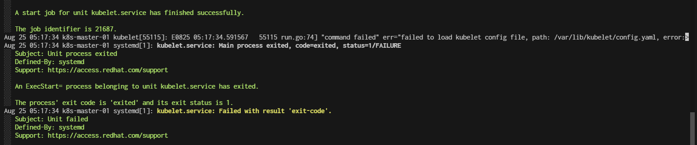
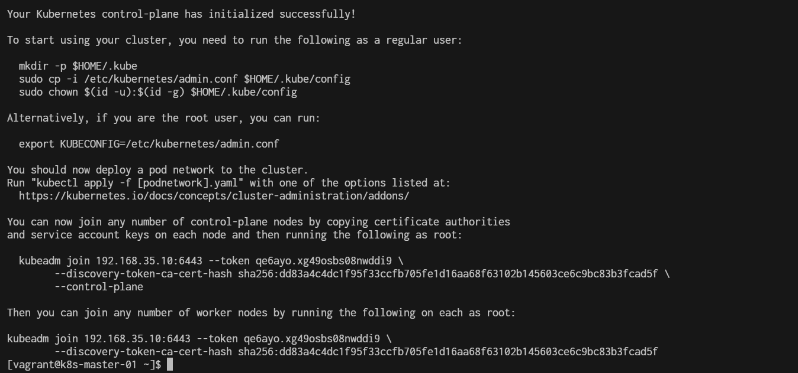
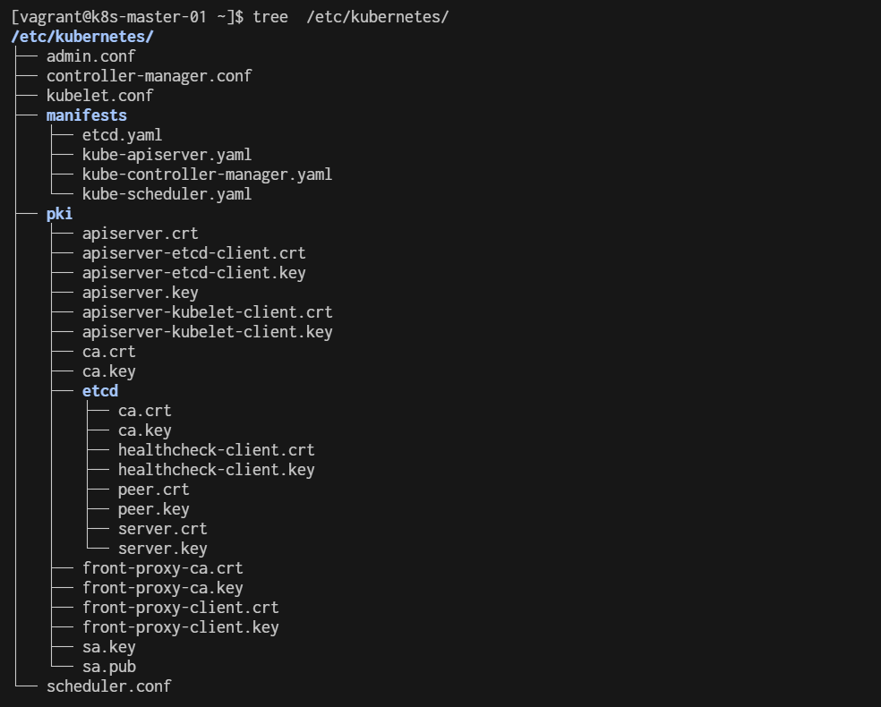
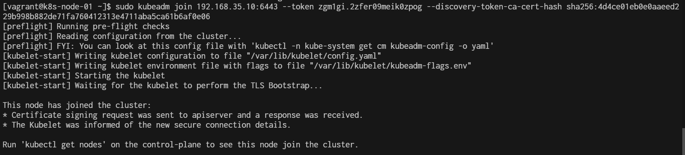
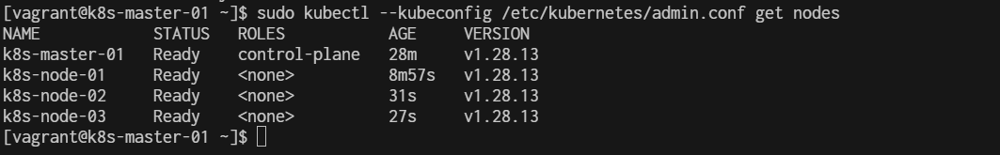
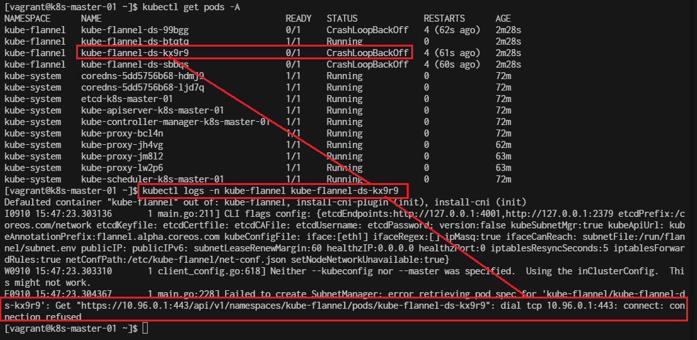

# Chapter 1
Infrastructure


vagrantfile
```ruby
# -*- mode: ruby -*-
# vi: set ft=ruby :

# All Vagrant configuration is done below. The "2" in Vagrant.configure
# configures the configuration version (we support older styles for
# backwards compatibility). Please don't change it unless you know what
# you're doing.

$script=<<-SCRIPT
    echo "\nStart Script"
    sed -i 's/PasswordAuthentication no/PasswordAuthentication yes/g' /etc/ssh/sshd_config    
    systemctl restart sshd.service
    sudo dnf update -y
    sudo dnf install -y firewalld
    sudo systemctl enable --now firewalld

    # Disable Selinux
    sudo setenforce 0
    sudo sed -i 's/^SELINUX=enforcing$/SELINUX=permissive/' /etc/selinux/config


    # Install docker engine
    sudo dnf config-manager --add-repo=https://download.docker.com/linux/centos/docker-ce.repo
    sudo dnf install -y docker-ce docker-ce-cli containerd.io
    sudo systemctl enable --now docker
    sudo usermod -aG docker vagrant
    
    # install containerd daemon
    sudo dnf install -y containerd.io
    sudo systemctl enable --now containerd

    # Enable kernel network
cat <<EOF | sudo tee /etc/sysctl.d/k8s.conf
net.ipv4.ip_forward = 1
net.bridge.bridge-nf-call-ip6tables = 1
net.bridge.bridge-nf-call-iptables = 1
EOF

    sudo sysctl --system
 
    # Load kernel module
cat <<EOF | sudo /etc/modules-load.d/k8s.conf 
overlay
br_netfilter
EOF
    sudo modprobe overlay
    sudo modbrobe br_netfilter
    
    echo "show kernel module"
    sudo lsmod | grep overlay
    sudo lsmod | grep br_netfilter
    
    # Enable Firewall
    sudo firewall-cmd --permanent --add-port={6443,2379,2380,10250,10251,10252}/tcp
    sudo firewall-cmd --reload

    # Install kubenetest
cat <<EOF | sudo tee /etc/yum.repos.d/kubernetes.repo
[kubernetes]
name=Kubernetes
baseurl=https://pkgs.k8s.io/core:/stable:/v1.28/rpm/
enabled=1
gpgcheck=1
gpgkey=https://pkgs.k8s.io/core:/stable:/v1.28/rpm/repodata/repomd.xml.key
exclude=kubelet kubeadm kubectl cri-tools kubernetes-cni
EOF

  
    sudo dnf install -y kubelet kubeadm kubectl --disableexcludes=kubernetes
    sudo systemctl enable --now kubelet
    echo "\nRun command: sudo systemctl status kubelet"
    sudo systemctl status kubelet

    source <(kubectl completion bash)
    sudo kubectl completion bash | sudo tee  /etc/bash_completion.d/kubectl

    sudo mv /etc/containerd/config.toml  /etc/containerd/config.toml.orgi
    sudo containerd config default | sudo tee /etc/containerd/config.toml

    sudo sed -i 's/SystemdCgroup = false/SystemdCgroup = true/g' /etc/containerd/config.toml
   
    sudo systemctl restart containerd   
    sudo systemctl status containerd.service

cat <<EOF   | sudo tee -a /etc/sysctl.conf
net.bridge.bridge-nf-call-iptables=1
net.ipv4.ip_forward=1
EOF
    sudo "show sysctl -p"
    sudo sysctl -p

SCRIPT

Vagrant.configure("2") do |config|
  # The most common configuration options are documented and commented below.
  # For a complete reference, please see the online documentation at
  # https://docs.vagrantup.com.
  config.vm.box = "generic/centos9s"

  config.vm.define "k8s-master-01" do |control|
    control.vm.hostname = "k8s-master-01"
    control.vm.network "private_network", ip: "192.168.35.10"
    control.vm.provider "virtualbox" do |vb|
      vb.memory = "4096"
      vb.cpus = 4
    end

    control.vm.provision "shell", inline: <<-SCRIPT
        sudo hostnamectl set-hostname k8s-master-01
        # Disable Swap
        sudo swapoff -a
        sudo sed -i '/ swap / s/^\(.*\)$/#\1/g' /etc/fstab
    SCRIPT
  end

  config.vm.define "k8s-node-01" do |web|
    web.vm.hostname = "k8s-node-01"
    web.vm.network "private_network", ip: "192.168.35.21"
    web.vm.provider "virtualbox" do |vb|
      vb.memory = "2048"
      vb.cpus = 2
    end
    web.vm.provision "shell", inline: <<-SCRIPT
        sudo hostnamectl set-hostname k8s-node-01
        # Disable Swap
        sudo swapoff -a
        sudo sed -i '/ swap / s/^\(.*\)$/#\1/g' /etc/fstab
    SCRIPT
  end

  config.vm.define "k8s-node-02" do |db|
    db.vm.hostname = "k8s-node-02"
    db.vm.network "private_network", ip: "192.168.35.22"
    db.vm.provider "virtualbox" do |vb|
      vb.memory = "2048"
      vb.cpus = 2
    end
    db.vm.provision "shell", inline: <<-SCRIPT
        sudo hostnamectl set-hostname k8s-node-02
        # Disable Swap
        sudo swapoff -a
        sudo sed -i '/ swap / s/^\(.*\)$/#\1/g' /etc/fstab
    SCRIPT
  end

  config.vm.define "k8s-node-03" do |db|
    db.vm.hostname = "k8s-node-03"
    db.vm.network "private_network", ip: "192.168.35.23"
    db.vm.provider "virtualbox" do |vb|
      vb.memory = "2048"
      vb.cpus = 2
    end
    db.vm.provision "shell", inline: <<-SCRIPT
        sudo hostnamectl set-hostname k8s-node-03
        # Disable Swap
        sudo swapoff -a
        sudo sed -i '/ swap / s/^\(.*\)$/#\1/g' /etc/fstab
    SCRIPT
  end

  #config.vm.synced_folder ".", "/vagrant"


  config.vm.provision "shell", inline: $script
end

```

**Create infrastructure**
```
vagrant up
```


# Explaination
**Step-1 Enable ssh password authentication**
```
sed -i 's/PasswordAuthentication no/PasswordAuthentication yes/g' /etc/ssh/sshd_config    
systemctl restart sshd.service
```
**Step-2 Enable firewall**
```
sudo dnf update -y
sudo dnf install -y firewalld
sudo systemctl enable --now firewalld
```
**Step-3 Disable SELinux**
```
# Disable Selinux
sudo setenforce 0
sudo sed -i 's/^SELINUX=enforcing$/SELINUX=permissive/' /etc/selinux/config
```

**Step-4: Disable swap permanently**
```
# Disable Swap
sudo swapoff -a
sudo sed -i '/ swap / s/^\(.*\)$/#\1/g' /etc/fstab
```

## Install docker engine
**Step-5 install docker engine**
```
# Install docker engine
sudo dnf config-manager --add-repo=https://download.docker.com/linux/centos/docker-ce.repo
sudo dnf install -y docker-ce docker-ce-cli containerd.io
sudo systemctl enable --now docker

# install containerd daemon
sudo dnf install -y containerd.io
sudo systemctl enable --now containerd
```

## Enable kernel network
**Step-6 Enable kernel network**
To ensure packets are properly processed by IP tables during filtering and port forwarding. Set the net.bridge.bridge-nf-call-iptables to ‘1’ in your sysctl config file.
```
# Enable kernel network
cat <<EOF | sudo tee /etc/sysctl.d/k8s.conf
net.ipv4.ip_forward = 1
net.bridge.bridge-nf-call-ip6tables = 1
net.bridge.bridge-nf-call-iptables = 1
EOF
```
Applying Kernel Settings Without Reboot.
```
sudo sysctl --system
```

**Step-7 Load kernel module**
```
# Load kernel module
cat <<EOF | sudo tee /etc/modules-load.d/k8s.conf 
overlay
br_netfilter
EOF

sudo modprobe overlay
sudo modprobe br_netfilter 

lsmod | grep overlay
lsmod | grep br_netfilter
```

- Kubernetes uses following service ports at Master node. Therefore, you need to allow these service ports in Linux firewall.

| Port       | Protocol | Purpose                     |
|------------|----------|-----------------------------|
| 6443       | TCP      | Kubernetes API server       |
| 2379-2380  | TCP      | etcd server client API       |
| 10250      | TCP      | Kubelet API                 |
| 10251      | TCP      | kube-scheduler              |
| 10252      | TCP      | kube-controller-manager     |


Here's a brief explanation of the ports and protocols related to Kubernetes components:

- 6443/TCP: This is the Kubernetes API server port. It is the main entry point for all REST commands used to control the cluster.

- 2379-2380/TCP: These ports are used by the etcd server client API. etcd is a distributed key-value store that Kubernetes uses to store all its cluster data.

- 10250/TCP: This port is for the Kubelet API. The Kubelet is responsible for managing individual nodes in the Kubernetes cluster and communicates with the API server.

- 10251/TCP: This port is used by the kube-scheduler. The scheduler is responsible for deciding which nodes will host newly created Pods.

- 10252/TCP: This port is for the kube-controller-manager. The controller manager is responsible for managing the various controllers that regulate the state of the cluster.

- 8472 (UDP): Flannel VXLAN traffic

- 2379-2380 (TCP): etcd (if applicable)

**Step-8 Enable Firewall**
```
# Enable Firewall
sudo firewall-cmd --permanent --add-port={6443,2379,2380,10250,10251,10252}/tcp
sudo firewall-cmd --permanent --add-port=8472/udp
sudo firewall-cmd --permanent --add-port=2379-2380/tcp
sudo firewall-cmd --reload
```

## Permanently Disable Swap
To ensure that swap remains disabled after a reboot, you need to comment out the swap entry in /etc/fstab.
Open the /etc/fstab file in a text editor:
```
sudo nano /etc/fstab
```

Find the line that refers to the swap partition or file. It will look something like this:
```
/dev/mapper/centos-swap swap swap defaults 0 0
```

Comment out this line by adding a # at the beginning:
```
# /dev/mapper/centos-swap swap swap defaults 0 0
```
Save and close the file.

Verify Swap is Disabled: After following the above steps, you can verify that swap is disabled by running:

```
free -h
```

# install kubernetes
**Step-9 Add Kubernetes Repository**
```
cat <<EOF | sudo tee /etc/yum.repos.d/kubernetes.repo
[kubernetes]
name=Kubernetes
baseurl=https://pkgs.k8s.io/core:/stable:/v1.28/rpm/
enabled=1
gpgcheck=1
gpgkey=https://pkgs.k8s.io/core:/stable:/v1.28/rpm/repodata/repomd.xml.key
exclude=kubelet kubeadm kubectl cri-tools kubernetes-cni
EOF


sudo dnf install -y kubelet kubeadm kubectl --disableexcludes=kubernetes
sudo systemctl enable --now kubelet
sudo systemctl status kubelet
sudo kubectl version

echo "Verify containerd"
sudo systemctl status containerd
```

**Step-10 Check kubelet log**
```
sudo journalctl -u kubelet -xe

```


>  **ERROR** 
>
>  err="failed to load kubelet config file, path: /var/lib/kubelet/config.yaml


# Enable Bash completion for kubernetes command

**Step-11 Add Bash completion**
```
source <(kubectl completion bash)
sudo kubectl completion bash | sudo tee /etc/bash_completion.d/kubectl
```

# Create a Kubernetes Cluster

**Step-12 Modify defualt config of containerd**

(Note: Run this command in Master Node only.)
- Run in very node (k8s-master-01,k8s-node-01,k8s-node-02,k8s-node-03)

```bash
sudo mv /etc/containerd/config.toml  /etc/containerd/config.toml.orgi
sudo containerd config default | sudo tee /etc/containerd/config.toml
sudo sed -i 's/SystemdCgroup = false/SystemdCgroup = true/g' /etc/containerd/config.toml
sudo grep -in systemd /etc/containerd/config.toml
```
Result after use ```sudo sed``` to edit config
```
73:    systemd_cgroup = false
139:            SystemdCgroup = true
```
> change at line 139 ``` SystemdCgroup = true```
> use command:

```
sudo systemctl restart containerd
sudo systemctl status containerd.service
```
- Test containerd is working by
```
# Pull image
sudo ctr image pull docker.io/library/hello-world:latest

# Run Container
sudo ctr run --rm docker.io/library/hello-world:latest test
```

**Step-13 create kubenetes control plan**


Run only in k8s-master-01. use kubeadm init to create control plain.
```
sudo kubeadm init  --control-plane-endpoint 192.168.35.10  --pod-network-cidr=10.244.0.0/16
```

- For flannel to work correctly, you must pass --pod-network-cidr=10.244.0.0/16 to kubeadm init.
Result Screen:




- Check kubelet
```
sudo systemctl status kubelet.service
```

- Note: Regenerate again when everv you want to create join string
```
sudo kubeadm token create --print-join-command
sudo kubeadm token create --print-join-command  > kubeadm_join_cmd.sh
```
To start using your cluster, you need to run the following as a regular user:


**Step-13 Allow vagrant user to run kubectl commands**
- Use kubectl below with sudo 
```
sudo kubectl --kubeconfig /etc/kubernetes/admin.conf get nodes
NAME            STATUS     ROLES           AGE     VERSION
k8s-master-01   NotReady   control-plane   4m15s   v1.28.13

```

- Run as vagrant use or normal user. we need to copy file admin.conf to vagrant use,,
by run command
```
  mkdir -p $HOME/.kube
  sudo cp -i /etc/kubernetes/admin.conf /home/vagrant/.kube/config
  sudo chown $(id -u vagrant):$(id -g vagrant) /home/vagrant/.kube/config
```

- Test get nodes (server) 
```
$ kubectl  get nodes 
NAME            STATUS     ROLES           AGE     VERSION
k8s-master-01   NotReady   control-plane   7m20s   v1.28.13
```

Alternatively, if you are the root user, you can run:

**Step-14 Install Pod network flannel**  
after install control plan, we need to install network plugin flannel
```
$ kubectl apply -f https://raw.githubusercontent.com/flannel-io/flannel/master/Documentation/kube-flannel.yml


namespace/kube-flannel created
serviceaccount/flannel created
clusterrole.rbac.authorization.k8s.io/flannel created
clusterrolebinding.rbac.authorization.k8s.io/flannel created
configmap/kube-flannel-cfg created
daemonset.apps/kube-flannel-ds created

```


**Step-15 Check master node after add flannel**

```
[vagrant@k8s-master-01 ~]$ kubectl get daemonset kube-flannel-ds -n kube-flannel
NAME              DESIRED   CURRENT   READY   UP-TO-DATE   AVAILABLE   NODE SELECTOR   AGE
kube-flannel-ds   4         4         1       4            1           <none>          5m23s
```

## In Future, you can add more control plain (just for understand) not now
(this step run in next k8s-master)
- You can now join any number of control-plane nodes by copying certificate authorities
and service account keys on each node and then running the following as root:

```
  kubeadm join 192.168.35.10:6443 --token qe6ayo.xg49osbs08nwddi9 \
        --discovery-token-ca-cert-hash sha256:dd83a4c4dc1f95f33ccfb705fe1d16aa68f63102b145603ce6c9bc83b3fcad5f \
        --control-plane
```
- add ```--control-plane```  add endof join string

- check /etc/kubenetes with `tree`



### Add Kubernetes node workload to master
- Then you can``` join any number of worker nodes by running the following on each as root:
- Run command in k8s-node-01,k8s-node-02,k8s-node-03

**Step-14 kubeadm join**

- Vagrant ssh to k8s-node-01 ( Repeat this stop in k8s-node-02, k8s-node-03)
```
$ vagrant ssh k8s-node-01
```

- Edit containerd configuration
```
sudo mv /etc/containerd/config.toml  /etc/containerd/config.toml.orgi
sudo containerd config default | sudo tee /etc/containerd/config.toml
sudo grep -in systemd /etc/containerd/config.toml
sudo sed -i 's/SystemdCgroup = false/SystemdCgroup = true/g' /etc/containerd/config.toml
sudo systemctl restart containerd
sudo systemctl status containerd.service
```

- Run Join
```
sudo kubeadm join 192.168.35.10:6443 --token qe6ayo.xg49osbs08nwddi9 \
        --discovery-token-ca-cert-hash sha256:dd83a4c4dc1f95f33ccfb705fe1d16aa68f63102b145603ce6c9bc83b3fcad5f
```

> Repeat in k8s-node-02, k8s-node-03



**Step-15 Verify Kubenetes Cluster**
- Test un on master (k8s-master-01) wait for node online 
```
$ $ sudo kubectl --kubeconfig /etc/kubernetes/admin.conf get nodes
NAME            STATUS   ROLES           AGE     VERSION
k8s-master-01   Ready    control-plane   28m     v1.28.13
k8s-node-01     Ready    <none>          8m57s   v1.28.13
k8s-node-02     Ready    <none>          31s     v1.28.13
k8s-node-03     Ready    <none>          27s     v1.28.13
```



**Step-16 Cluster info**
```
$ kubectl cluster-info
Kubernetes control plane is running at https://192.168.35.10:6443
CoreDNS is running at https://192.168.35.10:6443/api/v1/namespaces/kube-system/services/kube-dns:dns/proxy

To further debug and diagnose cluster problems, use 'kubectl cluster-info dump'.
```

**Step-17 Get All namespace**
```
$ kubectl get pods --all-namespaces
NAMESPACE      NAME                                    READY   STATUS             RESTARTS        AGE
kube-flannel   kube-flannel-ds-6vx9x                   0/1     CrashLoopBackOff   6 (4m16s ago)   10m
kube-flannel   kube-flannel-ds-9mnc8                   0/1     CrashLoopBackOff   6 (4m14s ago)   10m
kube-flannel   kube-flannel-ds-gg2g7                   0/1     CrashLoopBackOff   8 (2m11s ago)   18m
kube-flannel   kube-flannel-ds-lr75s                   1/1     Running            0               28m
kube-system    coredns-5dd5756b68-89xbf                1/1     Running            0               38m
kube-system    coredns-5dd5756b68-8xwm8                1/1     Running            0               38m
kube-system    etcd-k8s-master-01                      1/1     Running            0               38m
kube-system    kube-apiserver-k8s-master-01            1/1     Running            0               38m
kube-system    kube-controller-manager-k8s-master-01   1/1     Running            0               38m
kube-system    kube-proxy-79xkn                        1/1     Running            0               38m
kube-system    kube-proxy-mvb8q                        1/1     Running            0               10m
kube-system    kube-proxy-nck74                        1/1     Running            0               18m
kube-system    kube-proxy-vjg78                        1/1     Running            0               10m
kube-system    kube-scheduler-k8s-master-01            1/1     Running            0               38m
```

## Delete flannel and reinstall
```
[vagrant@k8s-master-01 ~]$ kubectl delete -f https://raw.githubusercontent.com/flannel-io/flannel/master/Documentation/kube-flannel.yml
namespace "kube-flannel" deleted
clusterrole.rbac.authorization.k8s.io "flannel" deleted
clusterrolebinding.rbac.authorization.k8s.io "flannel" deleted
serviceaccount "flannel" deleted
configmap "kube-flannel-cfg" deleted
daemonset.apps "kube-flannel-ds" deleted
```

```
$  wget https://raw.githubusercontent.com/flannel-io/flannel/master/Documentation/kube-flannel.yml

$ vim kube-flannel.yml
```

```
      containers:
      - name: kube-flannel
        image: docker.io/flannel/flannel:v0.25.6
        command:
        - /opt/bin/flanneld
        args:
        - --ip-masq
        - --kube-subnet-mgr
        - --iface=eth1
```

```
kubectl apply -f kube-flannel.yml
```

```
[vagrant@k8s-master-01 ~]$ kubectl get pods -A
NAMESPACE      NAME                                    READY   STATUS             RESTARTS      AGE
kube-flannel   kube-flannel-ds-99bgg                   0/1     Error              1 (10s ago)   13s
kube-flannel   kube-flannel-ds-btqtq                   1/1     Running            0             13s
kube-flannel   kube-flannel-ds-kx9r9                   0/1     Error              1 (10s ago)   13s
kube-flannel   kube-flannel-ds-sbbqs                   0/1     CrashLoopBackOff   1 (9s ago)    13s
kube-system    coredns-5dd5756b68-hdmj9                1/1     Running            0             69m
kube-system    coredns-5dd5756b68-ljd7q                1/1     Running            0             69m
kube-system    etcd-k8s-master-01                      1/1     Running            0             70m
kube-system    kube-apiserver-k8s-master-01            1/1     Running            0             70m
kube-system    kube-controller-manager-k8s-master-01   1/1     Running            0             70m
kube-system    kube-proxy-bcl4n                        1/1     Running            0             69m
kube-system    kube-proxy-jh4vg                        1/1     Running            0             60m
kube-system    kube-proxy-jm8l2                        1/1     Running            0             61m
kube-system    kube-proxy-lw2p6                        1/1     Running            0             61m
kube-system    kube-scheduler-k8s-master-01            1/1     Running            0             70m
```

- Get Descript
```
[vagrant@k8s-master-01 ~]$ kubectl describe pod -n kube-flannel kube-flannel-ds-kx9r9
```

- Get log of pod of kube-flannel-ds which Error CrashLoopBackOff

```
[vagrant@k8s-master-01 ~]$ kubectl logs -n kube-flannel kube-flannel-ds-kx9r9
```



- Restart Flannel
```
$ kubectl delete pod -n kube-flannel -l app=flannel
$ kubectl get pods --all-namespaces 
```


```
cat <<EOF   | sudo tee -a /etc/sysctl.conf
net.bridge.bridge-nf-call-iptables=1
EOF

[vagrant@k8s-master-01 ~]$ sudo tree  /var/lib/cni/
/var/lib/cni/
├── flannel
│   ├── cd2c2f5df03796725f879413789de71d5ec870980fcc78dbade54377a4d9d454
│   └── fed360a9e9a7c6931fbb7a39608d88f8b093323a73df2741a6ca23e3cb0975de
├── networks
│   └── cbr0
│       ├── 10.244.0.2
│       ├── 10.244.0.3
│       ├── last_reserved_ip.0
│       └── lock
└── results
    ├── cbr0-cd2c2f5df03796725f879413789de71d5ec870980fcc78dbade54377a4d9d454-eth0
    ├── cbr0-fed360a9e9a7c6931fbb7a39608d88f8b093323a73df2741a6ca23e3cb0975de-eth0
    ├── cni-loopback-cd2c2f5df03796725f879413789de71d5ec870980fcc78dbade54377a4d9d454-lo
    └── cni-loopback-fed360a9e9a7c6931fbb7a39608d88f8b093323a73df2741a6ca23e3cb0975de-lo

4 directories, 10 files
```