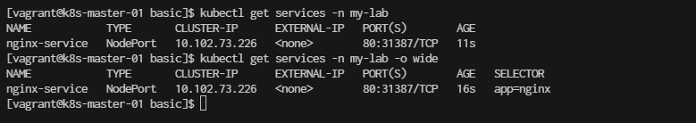

#  Basic Deployment with NodePort 


Beginners
A basic Kubernetes lab setup for beginners to understand how to deploy, scale, and manage applications in a Kubernetes cluster. In this example, we'll deploy an Nginx web server.  

**Step 1. Prerequisites**
Ensure you have the following:


```
[vagrant@k8s-master-01 basic]$ kubectl  get nodes -o wide
NAME            STATUS   ROLES           AGE     VERSION    INTERNAL-IP     EXTERNAL-IP   OS-IMAGE          KERNEL-VERSION          CONTAINER-RUNTIME
k8s-master-01   NotReady   control-plane   28m     v1.28.13   192.168.35.10   <none>        CentOS Stream 9   5.14.0-503.el9.x86_64   containerd://1.7.21
k8s-node-01     Ready      <none>          9m59s   v1.28.13   192.168.35.21   <none>        CentOS Stream 9   5.14.0-503.el9.x86_64   containerd://1.7.21
k8s-node-02     Ready      <none>          8m16s   v1.28.13   192.168.35.22   <none>        CentOS Stream 9   5.14.0-503.el9.x86_64   containerd://1.7.21
k8s-node-03     Ready      <none>          7m36s   v1.28.13   192.168.35.23   <none>        CentOS Stream 9   5.14.0-503.el9.x86_64   containerd://1.7.21
```
Result output:


```
[vagrant@k8s-master-01 basic]$ kubectl  describe nodes k8s-master-01 
```


>

## Start workshop 5: Basic Deployment
**Step 1. Prepare folder**
```
cd ~
mkdir basic
cd basic
```

**Step 2. Create a Namespace**
Namespaces are used to logically separate resources within a Kubernetes cluster. ```kubectl create namespace my-lab```
```
[vagrant@k8s-master-01 ~]$ kubectl create namespace my-lab
namespace/my-lab created
```

**Step 3. Deploy an Nginx Application**
We'll create a deployment resource for Nginx, which is a simple web server.

- 3.1 **Create a Deployment YAML File**
Create a file called nginx-deployment.yaml:
```
cat << EOF | tee nginx-deployment.yaml
apiVersion: apps/v1
kind: Deployment
metadata:
  name: nginx-deployment
  namespace: my-lab
  labels:
    app: nginx
spec:
  replicas: 3
  selector:
    matchLabels:
      app: nginx
  template:
    metadata:
      labels:
        app: nginx
    spec:
      containers:
      - name: nginx
        image: nginx:1.17
        ports:
        - containerPort: 80
EOF
```

- 3.2 **Apply the Deployment**
Run the following command to create the Nginx deployment:  ```kubectl apply -f nginx-deployment.yaml```

```
[vagrant@k8s-master-01 basic]$ kubectl apply -f nginx-deployment.yaml
deployment.apps/nginx-deployment created
```

Verify
```
[vagrant@k8s-master-01 basic]$ kubectl get deployments -n my-lab

[vagrant@k8s-master-01 basic]$ kubectl get pods -n my-lab

```
wait until STATUS is Running


**Step 4. Next We Expose the Nginx Application**
Create a Service to expose the Nginx application.

- 4.1 Create a Service YAML File
Create a file called nginx-service.yaml:

```
cat <<EOF |  tee nginx-service.yaml
apiVersion: v1
kind: Service
metadata:
  name: nginx-service
  namespace: my-lab
spec:
  selector:
    app: nginx
  ports:
    - protocol: TCP
      port: 80
      targetPort: 80
  type: NodePort

EOF
```

- 4.2 Apply the Service
Run the following command to create the service: ```kubectl apply -f nginx-service.yaml```
```
[vagrant@k8s-master-01 basic]$ kubectl apply -f nginx-service.yaml
service/nginx-service created
```

Check the service:  ```kubectl get services -n my-lab```
```
[vagrant@k8s-master-01 basic]$ kubectl get services -n my-lab
[vagrant@k8s-master-01 basic]$ kubectl get services -n my-lab -o wide
```



- 4.3 Access the Nginx Application
Find the NodePort assigned to your service:

```
[vagrant@k8s-master-01 basic]$ kubectl get svc nginx-service -n my-lab
```

- From file ```nginx-service.yaml``` port will random select. We will fix nodeport
```
[vagrant@k8s-master-01 basic]$ kubectl delete -f nginx-service.yaml
```

**create nginx-service-nodeport.yaml  fix nodeport 30001**
```
cat <<EOF  | tee nginx-service-nodeport.yaml
apiVersion: v1
kind: Service
metadata:
  name: nginx-nodeport
  namespace: my-lab
spec:
  type: NodePort
  selector:
    app: nginx  # Same selector as in the LoadBalancer service
  ports:
    - protocol: TCP
      port: 80         # Service Port
      targetPort: 80   # Container Port in the nginx pod
      nodePort: 30001  # NodePort for external access
EOF
```
- apply service
```
[vagrant@k8s-master-01 basic]$ kubectl apply -f nginx-service-nodeport.yaml
```


- verify ```kubectl get svc```
```
[vagrant@k8s-master-01 basic]$ kubectl get svc nginx-nodeport -n my-lab
[vagrant@k8s-master-01 basic]$ kubectl get svc nginx-nodeport -n my-lab -o wide
```


You can now access Nginx using your node’s IP and the assigned port:


```
http://<node-ip>:<node-port>
```
(try to connect to every node ip)


**Step 5. Scale the Nginx Deployment**
You can scale the deployment to run more replicas of Nginx:

```
[vagrant@k8s-master-01 basic]$ kubectl scale deployment/nginx-deployment --replicas=5 -n my-lab
deployment.apps/nginx-deployment scaled
```

```
[vagrant@k8s-master-01 basic]$ kubectl get pods -n my-lab
```
Result Output:


**Step 6. View Nginx Logs**
Check the logs of a specific Nginx pod: ``` kubectl logs <nginx-pod-name> -n my-lab```

```
[vagrant@k8s-master-01 basic]$ kubectl logs nginx-deployment-6b8f6d655f-84b58 -n my-lab
```

**Step 7. Clean up, Delete All Resources**
Once you're done with the lab, you can delete the resources:

```
[vagrant@k8s-master-01 basic]$ kubectl delete deployment nginx-deployment -n my-lab
deployment.apps "nginx-deployment" deleted

[vagrant@k8s-master-01 basic]$ kubectl delete service nginx-nodeport -n my-lab
service "nginx-nodeport" deleted

[vagrant@k8s-master-01 basic]$ kubectl delete namespace my-lab
namespace "my-lab" deleted

```

:)

