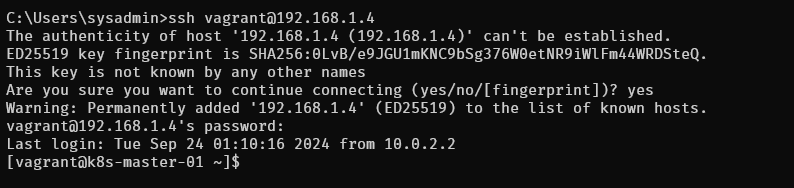

# Create bride interface

```
ip addr show eth1
```

```
sudo dnf install bridge-utils
```

```
sudo cp /etc/sysconfig/network-scripts/ifcfg-eth1 /etc/sysconfig/network-scripts/ifcfg-eth1.bak
```

```
cat <<EOF | sudo tee /etc/sysconfig/network-scripts/ifcfg-br0
TYPE=Bridge
NAME=br0
DEVICE=br0
ONBOOT=yes
BOOTPROTO=static      # or 'dhcp' if you are using DHCP
IPADDR=192.168.1.4  # Set your static IP address for the bridge
NETMASK=255.255.255.0
GATEWAY=192.168.1.1  # Update this to match your network gateway
DNS1=8.8.8.8          # Set a DNS server
EOF
```
- change 192.168.1.4 to ip of eth1
```
cat <<EOF | sudo tee /etc/sysconfig/network-scripts/ifcfg-eth1
TYPE=Ethernet
NAME=eth1
DEVICE=eth1
ONBOOT=yes
BRIDGE=br0
EOF
```

```
sudo ip addr flush dev eth1
sudo brctl addif br0 eth1
sudo systemctl restart NetworkManager
```

```
$ brctl show
bridge name     bridge id               STP enabled     interfaces
br0             8000.0800276dda2b       no              eth1
docker0         8000.024216b8edbf       no
```

```
$ ping 192.168.1.1
```

```
$ ip r
```

Test ssh from windows
```
C:\Users\sysadmin>ssh vagrant@192.168.1.4
```
