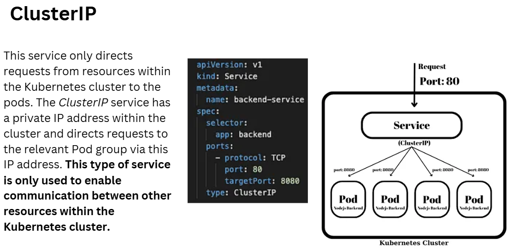
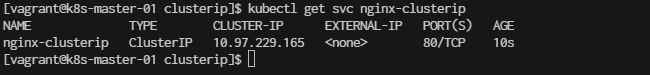
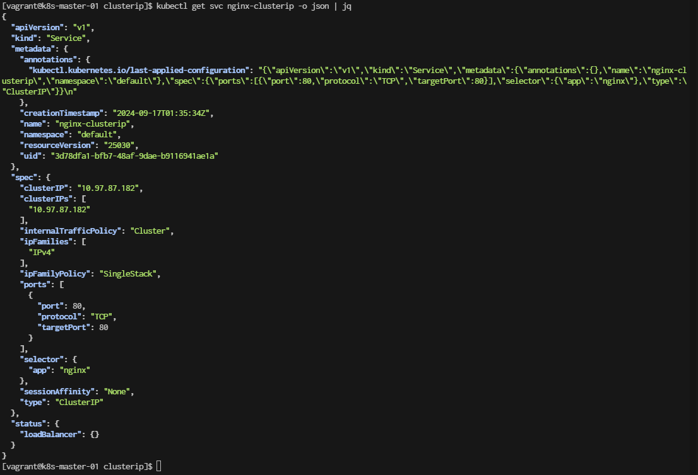
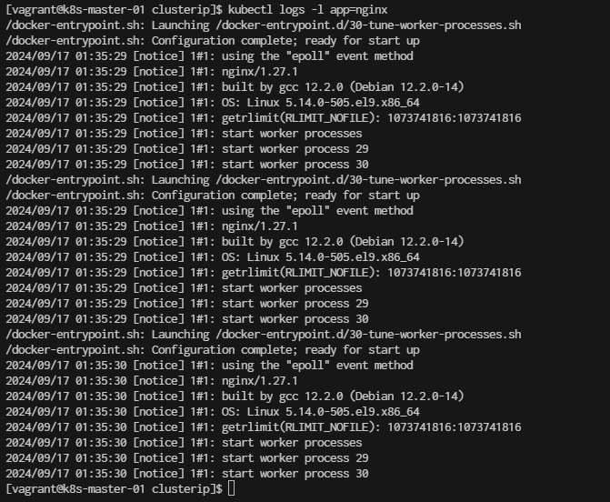
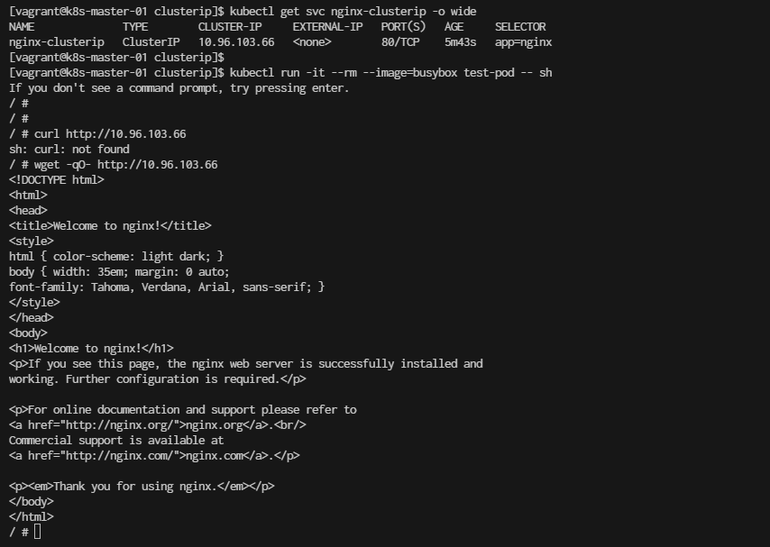

# ClusterIP Network


## Nginx with a ClusterIP Service

```
cd ~
mkdir clusterip
cd clusterip
```

**1. create nginx-deployment.yaml**
```
cat <<EOF | tee nginx-deployment.yaml
apiVersion: apps/v1
kind: Deployment
metadata:
  name: nginx-deployment
  labels:
    app: nginx
spec:
  replicas: 3
  selector:
    matchLabels:
      app: nginx  # This selector ensures the services will target these pods
  template:
    metadata:
      labels:
        app: nginx  # Label that matches the selector in services
    spec:
      containers:
      - name: nginx
        image: nginx:latest
        ports:
        - containerPort: 80
EOF
```

**Explanation:**
- apiVersion: apps/v1 is the current version used for deployments.
- kind: Defines that this resource is a Deployment.
- metadata: The deployment name is nginx-deployment.
- replicas: Specifies that 2 replicas (pods) of Nginx will be created.
- selector:
    -matchLabels: app: nginx ensures that the pods managed by this deployment are targeted by services with the same selector.
- template:
    - metadata: The label app: nginx is applied to the pods created by the deployment. This is critical because services use this label to route traffic to these pods.
    - containers: Defines the container inside the pod, in this case, using the nginx:latest image, and exposing port 80 (the default Nginx port).

Deploy the Nginx Deployment
To apply this deployment, run the following command:
```kubectl apply -f nginx-deployment.yaml```

```
[vagrant@k8s-master-01 clusterip]$ kubectl apply -f nginx-deployment.yaml
```

verify by ```kubectl get deployments.apps```
```
[vagrant@k8s-master-01 clusterip]$ kubectl get deployments.apps 
NAME               READY   UP-TO-DATE   AVAILABLE   AGE
nginx-deployment   0/2     2            0           9s
```
This deployment ensures that the Nginx pods will be accessible via the NodePort, LoadBalancer, or ClusterIP services you've set up, as all of them have the same selector: app: nginx.


**2. Create a ClusterIP Service for Nginx**
- create file   ```nginx-service-clusterip.yaml```
```
cat <<EOF | tee nginx-service-clusterip.yaml
apiVersion: v1
kind: Service
metadata:
  name: nginx-clusterip
spec:
  type: ClusterIP
  selector:
    app: nginx
  ports:
    - protocol: TCP
      port: 80         # Service port
      targetPort: 80   # Port inside the Nginx pod
EOF
```
**Explanation:**
- Type: ClusterIP — This exposes the service on an internal IP in the cluster, only accessible from other services or pods within the cluster.
- The selector (app: nginx) ensures that traffic is routed to the Nginx pods.

**Apply the clusterIP service**
```
[vagrant@k8s-master-01 clusterip]$ kubectl apply -f nginx-service-clusterip.yaml
```


Check the service

Once the ClusterIP service is created, you can check the details of the service, including the cluster-internal IP address:

```
[vagrant@k8s-master-01 clusterip]$ kubectl get svc nginx-clusterip
NAME              TYPE        CLUSTER-IP      EXTERNAL-IP   PORT(S)   AGE
nginx-clusterip   ClusterIP   10.97.229.165   <none>        80/TCP    10s
```
Result output:


```
[vagrant@k8s-master-01 clusterip]$ kubectl get svc nginx-clusterip -o json | jq
```



Check pods logs
```
[vagrant@k8s-master-01 clusterip]$ kubectl logs -l app=nginx
```




**Test ClusterIP**
Since this is a ClusterIP service, it’s accessible only within the cluster. You can test access to it by running a temporary pod or using another service in the cluster that can reach it.

To test the service, you can run a temporary pod like this:
```
[vagrant@k8s-master-01 clusterip]$ kubectl run -it --rm --image=busybox test-pod -- sh
```

Once inside the pod, you can use wget or curl to access the service:
```
# wget -qO- http://10.96.103.66
```


