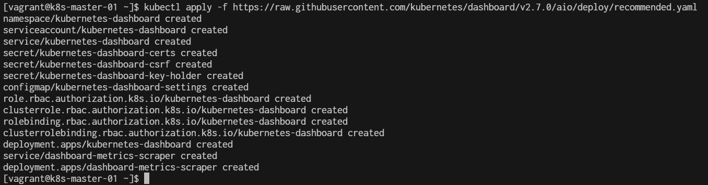

# Install Dasboard

1. Install the Kubernetes Dashboard
First, apply the official Kubernetes Dashboard YAML file:

```
kubectl apply -f https://raw.githubusercontent.com/kubernetes/dashboard/v2.7.0/aio/deploy/recommended.yaml

```
