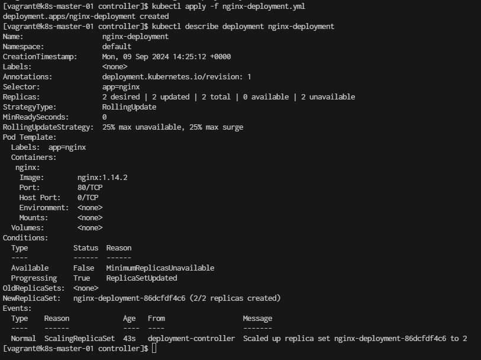

# Deploy first deployment

- Run on Master node
```
vagrant ssh k8s-master-01
```

create project folder
```
[vagrant@k8s-master-01 ~]$ mkdir controller
[vagrant@k8s-master-01 ~]$ cd controller
[vagrant@k8s-master-01 ~]$ vim nginx-deployment.yml
```

```yml
apiVersion: apps/v1
kind: Deployment
metadata:
  name: nginx-deployment
spec:
  selector:
    matchLabels:
      app: nginx
  replicas: 2 # tells deployment to run 2 pods matching the template
  template:
    metadata:
      labels:
        app: nginx
    spec:
      containers:
      - name: nginx
        image: nginx:1.14.2
        ports:
        - containerPort: 80
```

- Create a Deployment based on the YAML file:
```
[vagrant@k8s-master-01 controller]$ kubectl apply -f nginx-deployment.yml
deployment.apps/nginx-deployment created
```

- Display information about the Deployment:
```
kubectl describe deployment nginx-deployment
```

Result:
```
Name:                   nginx-deployment
Namespace:              default
CreationTimestamp:      Mon, 09 Sep 2024 14:25:12 +0000
Labels:                 <none>
Annotations:            deployment.kubernetes.io/revision: 1
Selector:               app=nginx
Replicas:               2 desired | 2 updated | 2 total | 0 available | 2 unavailable
StrategyType:           RollingUpdate
MinReadySeconds:        0
RollingUpdateStrategy:  25% max unavailable, 25% max surge
Pod Template:
  Labels:  app=nginx
  Containers:
   nginx:
    Image:        nginx:1.14.2
    Port:         80/TCP
    Host Port:    0/TCP
    Environment:  <none>
    Mounts:       <none>
  Volumes:        <none>
Conditions:
  Type           Status  Reason
  ----           ------  ------
  Available      False   MinimumReplicasUnavailable
  Progressing    True    ReplicaSetUpdated
OldReplicaSets:  <none>
NewReplicaSet:   nginx-deployment-86dcfdf4c6 (2/2 replicas created)
Events:
  Type    Reason             Age   From                   Message
  ----    ------             ----  ----                   -------
  Normal  ScalingReplicaSet  43s   deployment-controller  Scaled up replica set nginx-deployment-86dcfdf4c6 to 2
```




Run ```kubectl get deployments``` to check if the Deployment was created.

If the Deployment is still being created, the output is similar to the following:

```
[vagrant@k8s-master-01 controller]$ kubectl get deployments
NAME               READY   UP-TO-DATE   AVAILABLE   AGE
nginx-deployment   0/2     2            0           7m12s
```


When you inspect the Deployments in your cluster, the following fields are displayed:

- NAME lists the names of the Deployments in the namespace.
- READY displays how many replicas of the application are available to your users. It follows the pattern ready/desired.
- UP-TO-DATE displays the number of replicas that have been updated to achieve the desired state.
- AVAILABLE displays how many replicas of the application are available to your users.
- AGE displays the amount of time that the application has been running.

**Notice** how the number of desired replicas is 3 according to .spec.replicas field.

- To see the ReplicaSet (rs) created by the Deployment, run kubectl get rs. The output is similar to this:

```
[vagrant@k8s-master-01 controller]$ kubectl get rs
NAME                          DESIRED   CURRENT   READY   AGE
nginx-deployment-86dcfdf4c6   2         2         0       7m44s

```

ReplicaSet output shows the following fields:

- NAME lists the names of the ReplicaSets in the namespace.
- DESIRED displays the desired number of replicas of the application, which you define when you create the Deployment. This is the desired state.
- CURRENT displays how many replicas are currently running.
- READY displays how many replicas of the application are available to your users.
- AGE displays the amount of time that the application has been running.-

- To see the labels automatically generated for each Pod, run kubectl get pods --show-labels. The output is similar to:

```
[vagrant@k8s-master-01 controller]$ kubectl get pods --show-labels
NAME                                READY   STATUS              RESTARTS   AGE     LABELS
nginx-deployment-86dcfdf4c6-lpwjv   0/1     ContainerCreating   0          8m14s   app=nginx,pod-template-hash=86dcfdf4c6
nginx-deployment-86dcfdf4c6-n8qgn   0/1     ContainerCreating   0          8m14s   app=nginx,pod-template-hash=86dcfdf4c6
```


-Running get pods should now show only the new Pods  ```kubctl get pods```
```
[vagrant@k8s-master-01 controller]$ kubectl get pods 
NAME                                READY   STATUS              RESTARTS   AGE
nginx-deployment-86dcfdf4c6-lpwjv   0/1     ContainerCreating   0          8m46s
nginx-deployment-86dcfdf4c6-n8qgn   0/1     ContainerCreating   0          8m46s
```

- To see network  run ```kubectl get services```

```
[vagrant@k8s-master-01 ~]$ kubectl get services
NAME         TYPE        CLUSTER-IP   EXTERNAL-IP   PORT(S)   AGE
kubernetes   ClusterIP   10.96.0.1    <none>        443/TCP   22h
```

- Delete deployment
```
[vagrant@k8s-master-01 ~]$ kubectl delete deployments.apps nginx-deployment 
deployment.apps "nginx-deployment" deleted
[vagrant@k8s-master-01 ~]$ kubectl delete pods  --all
No resources found
```