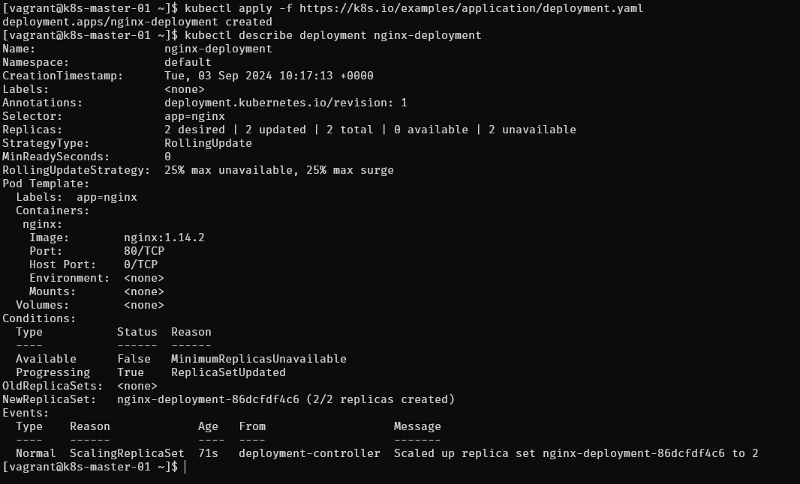

# Deploy first deployment

```yml
apiVersion: apps/v1
kind: Deployment
metadata:
  name: nginx-deployment
spec:
  selector:
    matchLabels:
      app: nginx
  replicas: 2 # tells deployment to run 2 pods matching the template
  template:
    metadata:
      labels:
        app: nginx
    spec:
      containers:
      - name: nginx
        image: nginx:1.14.2
        ports:
        - containerPort: 80
```

- Create a Deployment based on the YAML file:
```
kubectl apply -f https://k8s.io/examples/application/deployment.yaml
```

- Display information about the Deployment:
```
kubectl describe deployment nginx-deployment
```


