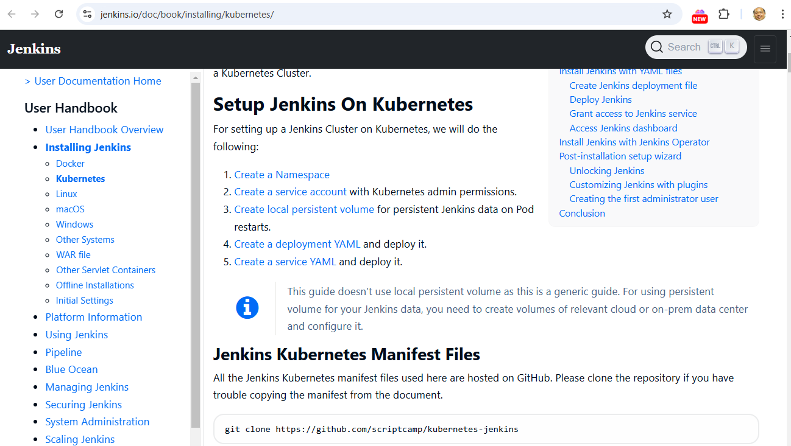
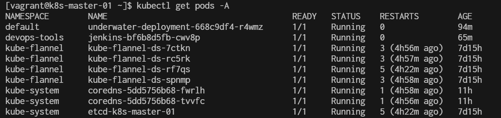
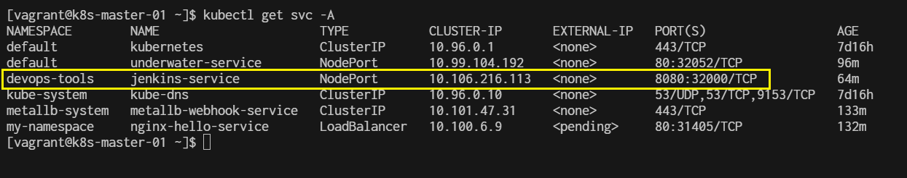
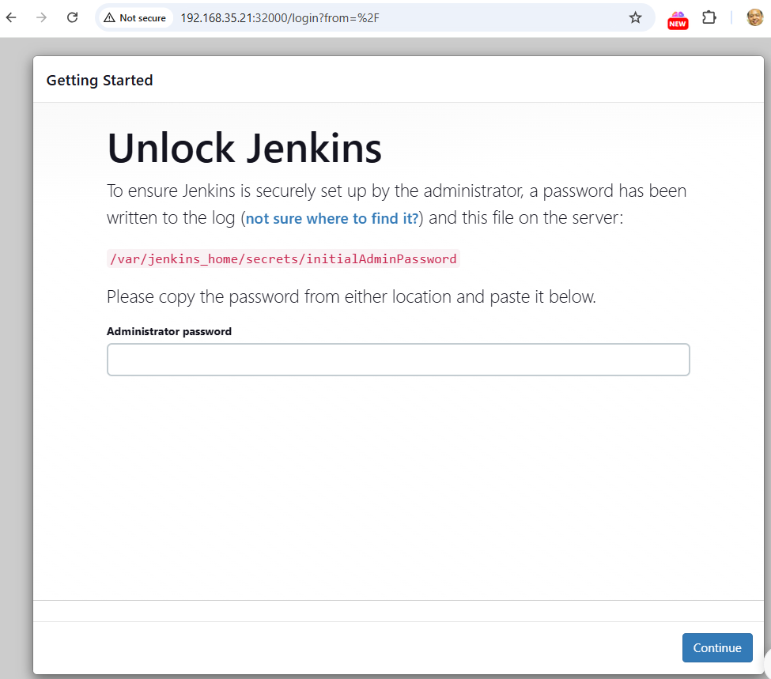
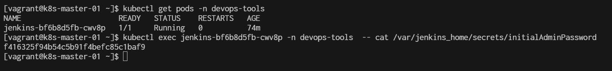
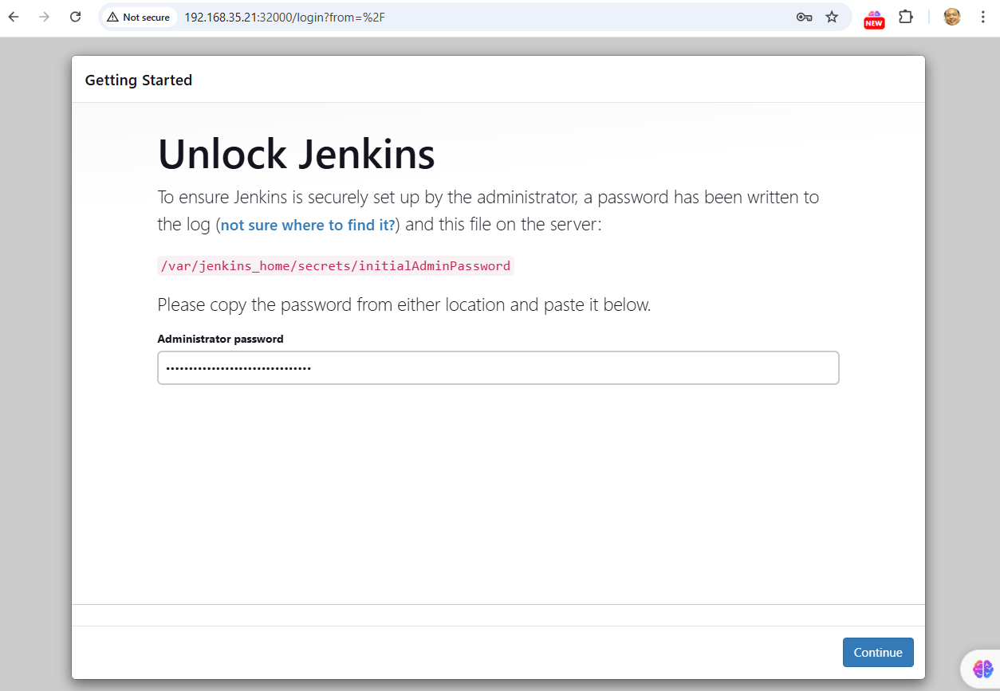
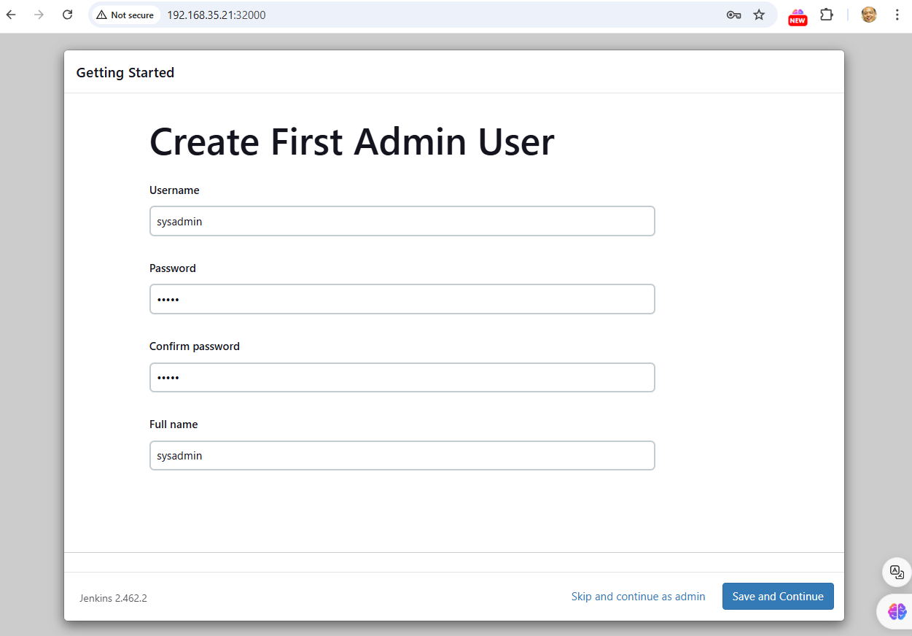
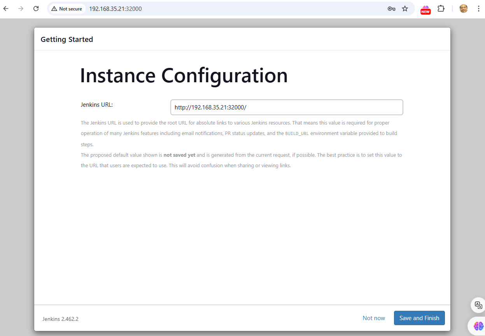
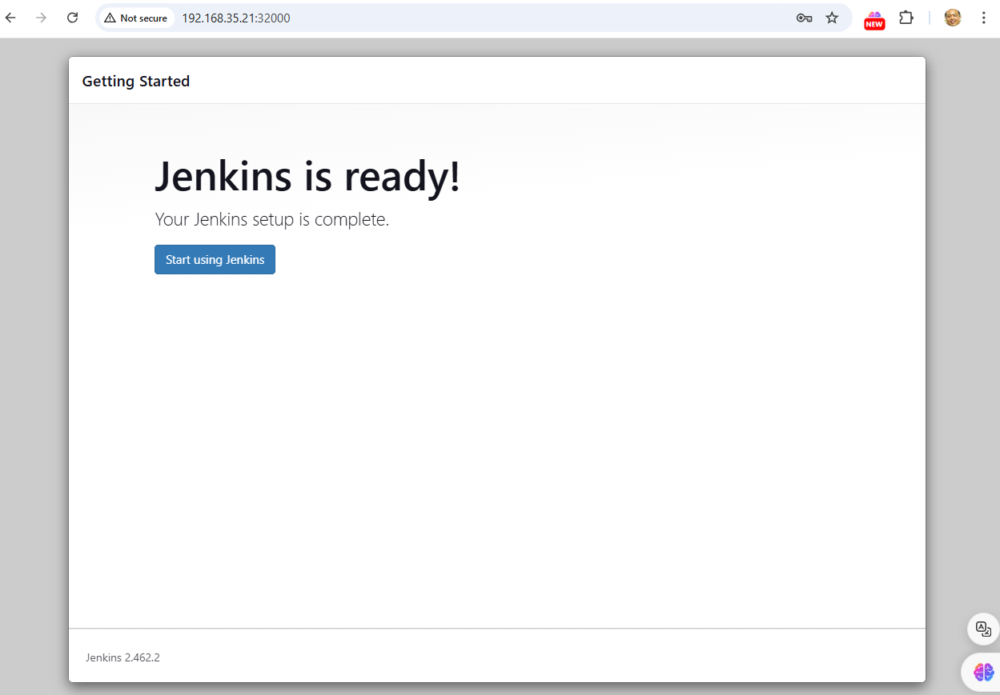
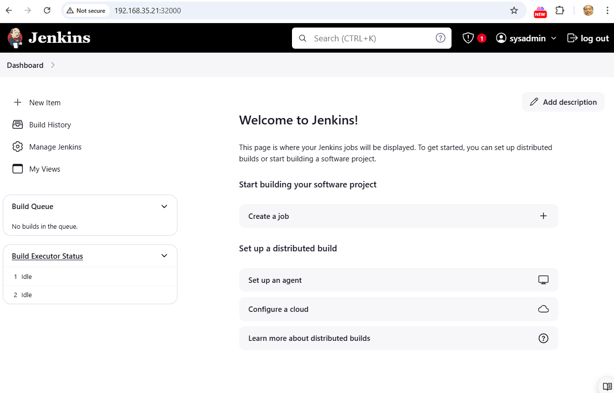

# Jenkin menifest
[https://www.jenkins.io/doc/book/installing/kubernetes/](https://www.jenkins.io/doc/book/installing/kubernetes/)



All the Jenkins Kubernetes manifest files used here are hosted on GitHub. Please clone the repository if you have trouble copying the manifest from the document.

- Create a Namespace

- Create a service account with Kubernetes admin permissions.

- Create local persistent volume for persistent Jenkins data on Pod restarts.

- Create a deployment YAML and deploy it.

- Create a service YAML and deploy it.

```
git clone https://github.com/scriptcamp/kubernetes-jenkins
```

**Kubernetes Jenkins Deployment**  
Let’s get started with deploying Jenkins on Kubernetes.

Step 1: Create a Namespace for Jenkins. It is good to categorize all the DevOps tools as a separate namespace from other applications.
```
$ kubectl create namespace devops-tools
namespace/devops-tools created
```

Step 2: Create a 'serviceAccount.yaml' file and copy the following admin service account manifest.
```
cat <<EOF | tee serviceAccount.yaml
---
apiVersion: rbac.authorization.k8s.io/v1
kind: ClusterRole
metadata:
  name: jenkins-admin
rules:
  - apiGroups: [""]
    resources: ["*"]
    verbs: ["*"]
---
apiVersion: v1
kind: ServiceAccount
metadata:
  name: jenkins-admin
  namespace: devops-tools
---
apiVersion: rbac.authorization.k8s.io/v1
kind: ClusterRoleBinding
metadata:
  name: jenkins-admin
roleRef:
  apiGroup: rbac.authorization.k8s.io
  kind: ClusterRole
  name: jenkins-admin
subjects:
- kind: ServiceAccount
  name: jenkins-admin
  namespace: devops-tools
EOF
```

The 'serviceAccount.yaml' creates a 'jenkins-admin' clusterRole, 'jenkins-admin' ServiceAccount and binds the 'clusterRole' to the service account.

The 'jenkins-admin' cluster role has all the permissions to manage the cluster components. You can also restrict access by specifying individual resource actions.

Now create the service account using kubectl.

```
$ kubectl apply -f serviceAccount.yaml
clusterrole.rbac.authorization.k8s.io/jenkins-admin created
serviceaccount/jenkins-admin created
clusterrolebinding.rbac.authorization.k8s.io/jenkins-admin created
```

Step 3: Create 'volume.yaml' and copy the following persistent volume manifest.

```
cat <<EOF | tee volume.yaml
kind: StorageClass
apiVersion: storage.k8s.io/v1
metadata:
  name: local-storage
provisioner: kubernetes.io/no-provisioner
volumeBindingMode: WaitForFirstConsumer
---
apiVersion: v1
kind: PersistentVolume
metadata:
  name: jenkins-pv-volume
  labels:
    type: local
spec:
  storageClassName: local-storage
  claimRef:
    name: jenkins-pv-claim
    namespace: devops-tools
  capacity:
    storage: 10Gi
  accessModes:
    - ReadWriteOnce
  local:
    path: /mnt
  nodeAffinity:
    required:
      nodeSelectorTerms:
      - matchExpressions:
        - key: kubernetes.io/hostname
          operator: In
          values:
          - k8s-node-01
---
apiVersion: v1
kind: PersistentVolumeClaim
metadata:
  name: jenkins-pv-claim
  namespace: devops-tools
spec:
  storageClassName: local-storage
  accessModes:
    - ReadWriteOnce
  resources:
    requests:
      storage: 3Gi
EOF
```

Replace 'k8s-node-01' with any one of your cluster worker nodes hostname.

You can get the worker node hostname using the kubectl.
```
$ kubectl get nodes
```

Let’s create the volume using kubectl:
```
$ kubectl create -f volume.yaml
storageclass.storage.k8s.io/local-storage created
persistentvolume/jenkins-pv-volume created
persistentvolumeclaim/jenkins-pv-claim created
```

Step 4: Create a Deployment file named 'jenkins-deployment.yaml' and copy the following deployment manifest.
```
cat <<EOF | tee jenkins-deployment.yaml
apiVersion: apps/v1
kind: Deployment
metadata:
  name: jenkins
  namespace: devops-tools
spec:
  replicas: 1
  selector:
    matchLabels:
      app: jenkins-server
  template:
    metadata:
      labels:
        app: jenkins-server
    spec:
      securityContext:
            fsGroup: 1000
            runAsUser: 1000
      serviceAccountName: jenkins-admin
      containers:
        - name: jenkins
          image: jenkins/jenkins:lts
          resources:
            limits:
              memory: "2Gi"
              cpu: "1000m"
            requests:
              memory: "500Mi"
              cpu: "500m"
          ports:
            - name: httpport
              containerPort: 8080
            - name: jnlpport
              containerPort: 50000
          livenessProbe:
            httpGet:
              path: "/login"
              port: 8080
            initialDelaySeconds: 90
            periodSeconds: 10
            timeoutSeconds: 5
            failureThreshold: 5
          readinessProbe:
            httpGet:
              path: "/login"
              port: 8080
            initialDelaySeconds: 60
            periodSeconds: 10
            timeoutSeconds: 5
            failureThreshold: 3
          volumeMounts:
            - name: jenkins-data
              mountPath: /var/jenkins_home
      volumes:
        - name: jenkins-data
          persistentVolumeClaim:
              claimName: jenkins-pv-claim
EOF
```

Create the deployment using kubectl.
```
$ kubectl apply -f jenkins-deployment.yaml
deployment.apps/jenkins created
```

Check deployemt status:
```
$ kubectl get deployments -n devops-tools
```

Now, you can get the deployment details using the following command.
```
$ kubectl describe deployments --namespace=devops-tools
```

create service.yaml
```
cat <<EOF | tee jenkins-service.yaml
apiVersion: v1
kind: Service
metadata:
  name: jenkins-service
  namespace: devops-tools
  annotations:
      prometheus.io/scrape: 'true'
      prometheus.io/path:   /
      prometheus.io/port:   '8080'
spec:
  selector:
    app: jenkins-server
  type: NodePort
  ports:
    - port: 8080
      targetPort: 8080
      nodePort: 32000
EOF
```

apply service
```
$ kubectl apply -f jenkins-service.yaml 
service/jenkins-service created
```

```
$ kubectl get pods -A
```



```
$ kubectl get svc -A
```




login nodeport 32000
```
http://192.168.35.21:32000/
```


# how to get ```/var/jenkins_home/secrets/initialAdminPassword```

```
$ kubectl get pods -n devops-tools
NAME                      READY   STATUS    RESTARTS   AGE
jenkins-bf6b8d5fb-cwv8p   1/1     Running   0          74m
$ kubectl exec jenkins-bf6b8d5fb-cwv8p -n devops-tools  -- cat /var/jenkins_home/secrets/initialAdminPassword
f416325f94b54c5b91f4befc85c1baf9
[vagrant@k8s-master-01 ~]$ 
```




- f416325f94b54c5b91f4befc85c1baf9







