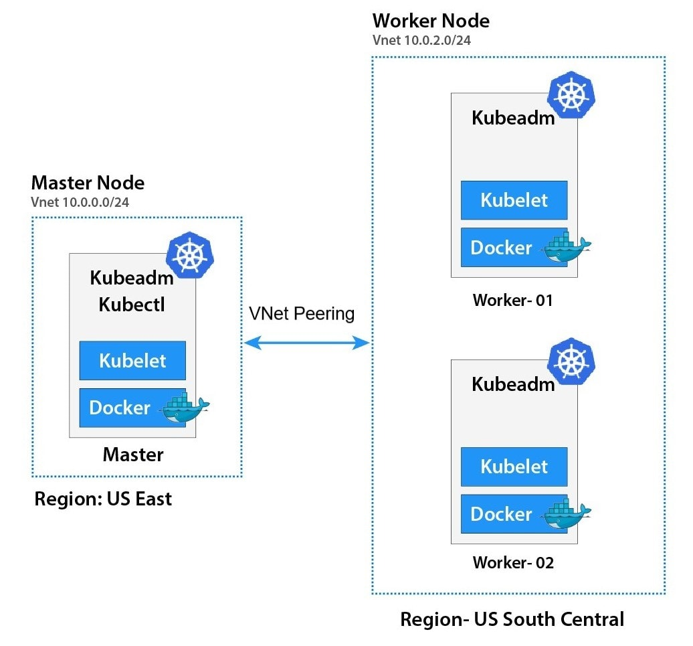
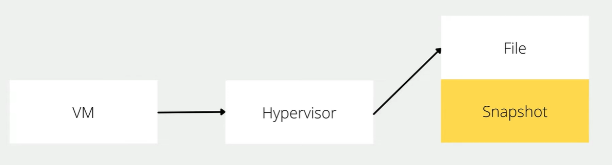

# Chapter 1
Infrastructure



vagrantfile
```ruby
# -*- mode: ruby -*-
# vi: set ft=ruby :

# All Vagrant configuration is done below. The "2" in Vagrant.configure
# configures the configuration version (we support older styles for
# backwards compatibility). Please don't change it unless you know what
# you're doing.

$base=<<-SCRIPT
    echo ">>> Run Kubernetes Base script"
    echo "-----------------------------------------------"
    echo "\nStep-1 Enable ssh password authentication"
    echo $(whoami)
    sed -i 's/PasswordAuthentication no/PasswordAuthentication yes/g' /etc/ssh/sshd_config    
    systemctl restart sshd.service
    echo "\nStep-2 Enable firewall"
    sudo dnf update -y
    sudo dnf install -y firewalld socat
    sudo systemctl enable --now firewalld

    # Step-3 Disable SELinux
    echo "\nStep-3 Disable SELinux"
    sudo setenforce 0
    sudo sed -i 's/^SELINUX=enforcing$/SELINUX=permissive/' /etc/selinux/config


    # Step-4 manage kernel module
    echo "\nStep-4 manage kernel module"
cat <<EOF | sudo tee /etc/sysctl.d/k8s.conf
net.ipv4.ip_forward = 1
net.bridge.bridge-nf-call-ip6tables = 1
net.bridge.bridge-nf-call-iptables = 1
EOF

    sudo "show sysctl -p"
    sudo sysctl -p
    sudo sysctl --system
 
    # Load kernel module
cat <<EOF | sudo /etc/modules-load.d/k8s.conf 
overlay
br_netfilter
ip_vs
ip_vs_rr
ip_vs_wrr
ip_vs_sh
EOF
    sudo modprobe br_netfilter
    sudo modprobe ip_vs
    sudo modprobe ip_vs_rr
    sudo modprobe ip_vs_wrr
    sudo modprobe ip_vs_sh
    sudo modprobe overlay

    # Step-5: Disable swap permanently
    echo "\nStep-5: Disable swap permanently"
    sudo swapoff -a
    sudo sed -e '/swap/s/^/#/g' -i /etc/fstab

    # Step-6: Enable Enable firewall port
    echo "\nStep-6: Enable Enable firewall port"
    sudo firewall-cmd --zone=public --permanent --add-port=443/tcp
    sudo firewall-cmd --zone=public --permanent --add-port=6443/tcp
    sudo firewall-cmd --zone=public --permanent --add-port=2379-2380/tcp
    sudo firewall-cmd --zone=public --permanent --add-port=10250/tcp
    sudo firewall-cmd --zone=public --permanent --add-port=10251/tcp
    sudo firewall-cmd --zone=public --permanent --add-port=10252/tcp
    sudo firewall-cmd --zone=public --permanent --add-port=10255/tcp
    sudo firewall-cmd --zone=public --permanent --add-port=5473/tcp
    sudo firewall-cmd --permanent --add-port 10250/tcp --add-port 30000-32767/tcp 

    # Flannel port
    sudo firewall-cmd --permanent --add-port=8472/udp
    # Etcd port
    sudo firewall-cmd --permanent --add-port=2379-2380/tcp
    sudo firewall-cmd --reload

    
    # Step-7: Enable Hostname

    echo "Step7 Enable Hostname"
cat <<EOF | sudo tee /etc/hosts
127.0.0.1   localhost localhost.localdomain localhost4 localhost4.localdomain4
::1         localhost localhost.localdomain localhost6 localhost6.localdomain6

127.0.0.1 centos9s.localdomain

192.168.35.10  k8s-master-01 k8s-master-01
192.168.35.21  k8s-node-01  k8s-node-01
192.168.35.22  k8s-node-02  k8s-node-02
192.168.35.23  k8s-node-03  k8s-node-03
EOF

SCRIPT


$node_crio=<<-SCRIPT
    echo ">>> Run Kubernetes node script"
    echo "-----------------------------------------------"
    echo "\nStep1 Install crio engine"
    # Install crio engine
cat <<EOF | sudo tee /etc/yum.repos.d/crio.repo 
[cri-o]
name=CRI-O
baseurl=https://pkgs.k8s.io/addons:/cri-o:/prerelease:/main/rpm/
enabled=1
gpgcheck=1
gpgkey=https://pkgs.k8s.io/addons:/cri-o:/prerelease:/main/rpm/repodata/repomd.xml.key
EOF
    sudo dnf install -y cri-o
    sudo systemctl enable crio --now
    sudo systemctl status crio
    sudo journalctl -u crio

    # Install kubenetest
    echo "\nStep2 Install kubenetest"
cat <<EOF | sudo tee /etc/yum.repos.d/kubernetes.repo
[kubernetes]
name=Kubernetes
baseurl=https://pkgs.k8s.io/core:/stable:/v1.28/rpm/
enabled=1
gpgcheck=1
gpgkey=https://pkgs.k8s.io/core:/stable:/v1.28/rpm/repodata/repomd.xml.key
exclude=kubelet kubeadm kubectl cri-tools kubernetes-cni
EOF

  
    sudo dnf install -y kubelet kubeadm kubectl --disableexcludes=kubernetes
    sudo systemctl enable --now kubelet

    echo "\nRun command: sudo systemctl status kubelet"
    sudo systemctl status kubelet

    # Enable Bash completion for kubernetes command
    source <(kubectl completion bash)
    sudo kubectl completion bash | sudo tee  /etc/bash_completion.d/kubectl
SCRIPT

$node_containerd=<<-SCRIPT
    echo ">>> Run Kubernetes node script"
    echo "-----------------------------------------------"
    echo "\nStep1 Install containerd engine"
    # Install docker engine
    sudo dnf config-manager --add-repo=https://download.docker.com/linux/centos/docker-ce.repo
    sudo dnf install -y docker-ce docker-ce-cli containerd.io
    sudo systemctl enable --now docker
    sudo usermod -aG docker vagrant
    
    # install containerd daemon
    sudo dnf install -y containerd.io
    sudo systemctl enable --now containerd

    # Install kubenetest
    echo "\nStep2 Install kubenetest"
cat <<EOF | sudo tee /etc/yum.repos.d/kubernetes.repo
[kubernetes]
name=Kubernetes
baseurl=https://pkgs.k8s.io/core:/stable:/v1.28/rpm/
enabled=1
gpgcheck=1
gpgkey=https://pkgs.k8s.io/core:/stable:/v1.28/rpm/repodata/repomd.xml.key
exclude=kubelet kubeadm kubectl cri-tools kubernetes-cni
EOF

  
    sudo dnf install -y kubelet kubeadm kubectl --disableexcludes=kubernetes
    sudo systemctl enable --now kubelet

    echo "\nRun command: sudo systemctl status kubelet"
    sudo systemctl status kubelet

    source <(kubectl completion bash)
    sudo kubectl completion bash | sudo tee  /etc/bash_completion.d/kubectl

    echo "\nStep3 Config containerd with systemdCroup"
    sudo mv /etc/containerd/config.toml  /etc/containerd/config.toml.orgi
    sudo containerd config default | sudo tee /etc/containerd/config.toml
    sudo sed -i 's/SystemdCgroup = false/SystemdCgroup = true/g' /etc/containerd/config.toml
   
    sudo systemctl restart containerd   
    sudo systemctl status containerd.service
    echo "\mStep4 Test pull and run image"
    sudo ctr image pull docker.io/library/hello-world:latest
    sudo ctr run --rm docker.io/library/hello-world:latest test
SCRIPT

Vagrant.configure("2") do |config|
  # The most common configuration options are documented and commented below.
  # For a complete reference, please see the online documentation at
  # https://docs.vagrantup.com.
  config.vm.box = "generic/centos9s"

  config.vm.define "k8s-master-01" do |control|
    control.vm.hostname = "k8s-master-01"
    control.vm.network "private_network", ip: "192.168.35.10"
    control.vm.provider "virtualbox" do |vb|
      vb.memory = "4096"
      vb.cpus = 4
    end

    control.vm.provision "shell", inline: $base
    control.vm.provision "shell", inline: $node_containerd
  end

  config.vm.define "k8s-node-01" do |node1|
    node1.vm.hostname = "k8s-node-01"
    node1.vm.network "private_network", ip: "192.168.35.21"
    node1.vm.provider "virtualbox" do |vb|
      vb.memory = "2048"
      vb.cpus = 2
    end

    node1.vm.provision "shell", inline: $base
    node1.vm.provision "shell", inline: $node_containerd
  end

  config.vm.define "k8s-node-02" do |node2|
    node2.vm.hostname = "k8s-node-02"
    node2.vm.network "private_network", ip: "192.168.35.22"
    node2.vm.provider "virtualbox" do |vb|
      vb.memory = "2048"
      vb.cpus = 2
    end
    node2.vm.provision "shell", inline: $base
    node2.vm.provision "shell", inline: $node_containerd
  end

  config.vm.define "k8s-node-03" do |node3|
    node3.vm.hostname = "k8s-node-03"
    node3.vm.network "private_network", ip: "192.168.35.23"
    node3.vm.provider "virtualbox" do |vb|
      vb.memory = "2048"
      vb.cpus = 2
    end
    node3.vm.provision "shell", inline: $base
    node3.vm.provision "shell", inline: $node_containerd
  end

  #config.vm.synced_folder ".", "/vagrant"


  
end

```

or Download from [Raw Vagrantfile](https://gist.githubusercontent.com/opendevbook/84a81d1ad8d12e3a49c911d554561603/raw/cbde0e908079db41ea46c0c25ab70ae6e5133490/Vagrantfile)


[jump to manual Lab installation](#start)

## Vagrantfile Structure
- Under picture will explain how Vagrantfile structure for Kubernetest Home lab


**Create infrastructure**
- vagrantfile in above section seperate script into 2 parts
  - base script: For prepare Linux VM (Centos 9 stream) to get ready before install container engine type and kubernetest
  - node_crio: Install crio + kubernetest
  - node_containerd: Install containerd + kubernetest

after run script then we install kubernetests with ```kubeamd init``` and select network (flannel or Calico) in master node. after that we join worker node to master node

### Start vagrant up and create snapshot first to save time in development
```
> vagrant up
> vagrant status
> vagrant halt
> vagrant snapshot save origin_state1
> vagrant snapshot list

```


### Snapshot technic will help you to setup clean point

- When we creat snapshot hypervisor will write change in to new files, and when we restore snapshot. hypervision will quickly discard change and get back to when we created our snapshot 
- Snapshots provides a method to lock virtual machine data
- After create snapshot we restore snapshot and continue to work
```
> vagrant snapshot restore origin_state1
```
[jump to manual Lab installation](#start)


## Explaination in Vagrant ssh script (Every Steps run by vagrant already)
### Part 1 Base script
- Base section script to prepare node for kubernetest
**Step-1 Enable ssh password authentication**
```
sed -i 's/PasswordAuthentication no/PasswordAuthentication yes/g' /etc/ssh/sshd_config    
systemctl restart sshd.service
```
**Step-2 Enable firewall**
```
sudo dnf update -y
sudo dnf install -y firewalld socat
sudo systemctl enable --now firewalld
```
**Step-3 Disable SELinux**
```
# Disable Selinux
sudo setenforce 0
sudo sed -i 's/^SELINUX=enforcing$/SELINUX=permissive/' /etc/selinux/config
```
#Step-4 manage kernel module"
```
cat <<EOF | sudo /etc/modules-load.d/k8s.conf 
overlay
br_netfilter
ip_vs
ip_vs_rr
ip_vs_wrr
ip_vs_sh
EOF
    sudo modprobe br_netfilter
    sudo modprobe ip_vs
    sudo modprobe ip_vs_rr
    sudo modprobe ip_vs_wrr
    sudo modprobe ip_vs_sh
    sudo modprobe overlay
```

**Step-5: Disable swap permanently**
```
# Disable Swap
sudo swapoff -a
sudo sed -i '/ swap / s/^\(.*\)$/#\1/g' /etc/fstab
```

**Step-6: Enable Enable firewall port**
```
sudo firewall-cmd --zone=public --permanent --add-port=443/tcp
sudo firewall-cmd --zone=public --permanent --add-port=6443/tcp
sudo firewall-cmd --zone=public --permanent --add-port=2379-2380/tcp
sudo firewall-cmd --zone=public --permanent --add-port=10250/tcp
sudo firewall-cmd --zone=public --permanent --add-port=10251/tcp
sudo firewall-cmd --zone=public --permanent --add-port=10252/tcp
sudo firewall-cmd --zone=public --permanent --add-port=10255/tcp
sudo firewall-cmd --zone=public --permanent --add-port=5473/tcp
sudo firewall-cmd --permanent --add-port 10250/tcp --add-port 30000-32767/tcp
# Flannel port
sudo firewall-cmd --permanent --add-port=8472/udp
# Etcd port
sudo firewall-cmd --permanent --add-port=2379-2380/tcp
sudo firewall-cmd --reload
```
>
Next part we can choose 
- node_crio for  Crio as Container engine
- node_container for  Containerd ad container engine

## Next part we can choose 

Crio and containerd are both container runtimes used to manage containerized applications, but they have different focuses and use cases. Here's a brief overview of each:

### Crio
- Purpose: Crio (Container Runtime Interface Open) is designed to be a lightweight, Kubernetes-native container runtime specifically for running containers in Kubernetes clusters. Its primary focus is to provide a high-performance and stable runtime for Kubernetes without unnecessary overhead.
- Integration: It is tightly integrated with Kubernetes and adheres to the Kubernetes Container Runtime Interface (CRI) specification. This means it can be used as a direct replacement for Docker in Kubernetes environments.
- Features:
  - Simplifies the Kubernetes container lifecycle management.
  - Supports Kubernetes features like PodSandbox.
  - Has a smaller footprint compared to Docker, as it is tailored specifically for Kubernetes.

### containerd
- Purpose: containerd is a core component of the container ecosystem that provides a high-level API for managing container lifecycle, including image transfer, container execution, and storage. It's more general-purpose compared to Crio.
- Integration: containerd can be used as the container runtime for Kubernetes but is not limited to it. It can also be used in other contexts, such as standalone container management.
- Features:
  - Manages container images and metadata.
  - Handles container execution and supervision.
  - Supports different image formats and can work with various container runtimes.
  - Used as a building block for other container runtimes like Docker and Cri-o.

In summary, Crio is specialized for Kubernetes environments, while containerd provides a more general-purpose container management solution that can be integrated into various container-based systems.

in Vagrantfile need to be select backend of kubernetest by change line in every node
```
    control.vm.provision "shell", inline: $base
    control.vm.provision "shell", inline: $node_containerd
```
-or-
```
    control.vm.provision "shell", inline: $base
    control.vm.provision "shell", inline: $node_crio
```

- node_crio for  Crio as Container engine
- node_container for  Containerd ad container engine

## node_crio script  (Run by Vagrant already)
- **Step1 Install crio engine**
```
    # Install crio engine
cat <<EOF | sudo tee /etc/yum.repos.d/crio.repo 
[cri-o]
name=CRI-O
baseurl=https://pkgs.k8s.io/addons:/cri-o:/prerelease:/main/rpm/
enabled=1
gpgcheck=1
gpgkey=https://pkgs.k8s.io/addons:/cri-o:/prerelease:/main/rpm/repodata/repomd.xml.key
EOF
    sudo dnf install -y cri-o
    sudo systemctl enable crio --now
    sudo systemctl status crio
    sudo journalctl -u crio
```

- **Step2 Install kubenetest**

```
cat <<EOF | sudo tee /etc/yum.repos.d/kubernetes.repo
[kubernetes]
name=Kubernetes
baseurl=https://pkgs.k8s.io/core:/stable:/v1.28/rpm/
enabled=1
gpgcheck=1
gpgkey=https://pkgs.k8s.io/core:/stable:/v1.28/rpm/repodata/repomd.xml.key
exclude=kubelet kubeadm kubectl cri-tools kubernetes-cni
EOF

  
    sudo dnf install -y kubelet kubeadm kubectl --disableexcludes=kubernetes
    sudo systemctl enable --now kubelet

    echo "\nRun command: sudo systemctl status kubelet"
    sudo systemctl status kubelet

    source <(kubectl completion bash)
    sudo kubectl completion bash | sudo tee  /etc/bash_completion.d/kubectl
```

## node_containerd script  (Run by Vagrant already)

- **Step1 Install containerd engine**
```
    sudo dnf config-manager --add-repo=https://download.docker.com/linux/centos/docker-ce.repo
    sudo dnf install -y docker-ce docker-ce-cli containerd.io
    sudo systemctl enable --now docker
    sudo usermod -aG docker vagrant
    
    # install containerd daemon
    sudo dnf install -y containerd.io
    sudo systemctl enable --now containerd
```

- **Step2 Install kubenetest**
```
    # Install kubenetest
cat <<EOF | sudo tee /etc/yum.repos.d/kubernetes.repo
[kubernetes]
name=Kubernetes
baseurl=https://pkgs.k8s.io/core:/stable:/v1.28/rpm/
enabled=1
gpgcheck=1
gpgkey=https://pkgs.k8s.io/core:/stable:/v1.28/rpm/repodata/repomd.xml.key
exclude=kubelet kubeadm kubectl cri-tools kubernetes-cni
EOF

  
    sudo dnf install -y kubelet kubeadm kubectl --disableexcludes=kubernetes
    sudo systemctl enable --now kubelet

    echo "\nRun command: sudo systemctl status kubelet"
    sudo systemctl status kubelet

    source <(kubectl completion bash)
    sudo kubectl completion bash | sudo tee  /etc/bash_completion.d/kubectl
```
- **Step3 Config containerd with systemdCroup**
```
    sudo mv /etc/containerd/config.toml  /etc/containerd/config.toml.orgi
    sudo containerd config default | sudo tee /etc/containerd/config.toml
    sudo sed -i 's/SystemdCgroup = false/SystemdCgroup = true/g' /etc/containerd/config.toml
   
    sudo systemctl restart containerd   
    sudo systemctl status containerd.service
```

- **Step4 Test pull and run image**
```
    echo "\mStep4 Test pull and run image"
    sudo ctr image pull docker.io/library/hello-world:latest
    sudo ctr run --rm docker.io/library/hello-world:latest test
```
>
## Kubernetest Firewall (For Reading)
- Kubernetes uses following service ports at Master node. Therefore, you need to allow these service ports in Linux firewall.

| Port       | Protocol | Purpose                     |
|------------|----------|-----------------------------|
| 6443       | TCP      | Kubernetes API server       |
| 2379-2380  | TCP      | etcd server client API       |
| 10250      | TCP      | Kubelet API                 |
| 10251      | TCP      | kube-scheduler              |
| 10252      | TCP      | kube-controller-manager     |
| 8472       | TCP      | Flannel                     |

Here's a brief explanation of the ports and protocols related to Kubernetes components:

- 6443/TCP: This is the Kubernetes API server port. It is the main entry point for all REST commands used to control the cluster.

- 2379-2380/TCP: These ports are used by the etcd server client API. etcd is a distributed key-value store that Kubernetes uses to store all its cluster data.

- 10250/TCP: This port is for the Kubelet API. The Kubelet is responsible for managing individual nodes in the Kubernetes cluster and communicates with the API server.

- 10251/TCP: This port is used by the kube-scheduler. The scheduler is responsible for deciding which nodes will host newly created Pods.

- 10252/TCP: This port is for the kube-controller-manager. The controller manager is responsible for managing the various controllers that regulate the state of the cluster.

- 8472 (UDP): Flannel VXLAN traffic

- 2379-2380 (TCP): etcd (if applicable)

## Start
<h3 style="color:blue">## Manual install will Start Here</h3>

**Run only in k8s-master-01**
- **First Check kubelet**
```
$ sudo systemctl status kubelet.service
```

- **use kubeadm init to create control plain.**
  - pull image
  - create cluster
```
$ sudo kubeadm config images pull

$ sudo kubeadm init \
  --control-plane-endpoint=192.168.35.10 \
  --pod-network-cidr=10.244.0.0/16 \
  --apiserver-advertise-address=192.168.35.10
```

- For flannel to work correctly, you must pass --pod-network-cidr=10.244.0.0/16 to kubeadm init.
Result Screen:

- Run as vagrant use or normal user. we need to copy file admin.conf to vagrant use,,
by run command
```
mkdir -p $HOME/.kube
sudo cp -i /etc/kubernetes/admin.conf /home/vagrant/.kube/config
sudo chown $(id -u vagrant):$(id -g vagrant) /home/vagrant/.kube/config
```

- Note: Regenerate again when everv you want to create join string. we can copy result from previous 
images or run follow command every time you needed, Recommand copy from result to nodepad
- Run result show onscreen
```
sudo kubeadm token create --print-join-command
```
- Run result save to file and scp copy over to node
```
sudo kubeadm token create --print-join-command  > kubeadm_join_cmd.sh
scp kubeadm_join_cmd.sh  vagrant@192.168.33.21
scp kubeadm_join_cmd.sh  vagrant@192.168.33.22
scp kubeadm_join_cmd.sh  vagrant@192.168.33.23
```

- Run Command ```kubectl get nodes```
```
kubectl  get nodes
NAME            STATUS     ROLES           AGE     VERSION
k8s-master-01   NotReady   control-plane   4m15s   v1.28.13
```

- Test get nodes (server) 
```
$ kubectl  get nodes -o wide
```
- Test get componentstatus
```
$ kubectl  get componentstatus
```
- Test Cluster-info
```
$ kubectl cluster-info
```


**Install Pod network flannel**  
Install a Pod Network Addon: You need to deploy a network plugin that matches the --pod-network-cidr you specified. For Flannel, you can apply the Flannel YAML file:

```
$ kubectl apply -f https://raw.githubusercontent.com/flannel-io/flannel/master/Documentation/kube-flannel.yml

namespace/kube-flannel created
serviceaccount/flannel created
clusterrole.rbac.authorization.k8s.io/flannel created
clusterrolebinding.rbac.authorization.k8s.io/flannel created
configmap/kube-flannel-cfg created
daemonset.apps/kube-flannel-ds created

```


**Check master node after add flannel**

```
[vagrant@k8s-master-01 ~]$ kubectl get daemonset kube-flannel-ds -n kube-flannel
```

### Add Kubernetes node workload to master
- Then you can``` join any number of worker nodes by running the following on each as root:
- Run command in k8s-node-01,k8s-node-02,k8s-node-03

**kubeadm join**

- Vagrant ssh to k8s-node-01 ( Repeat this stop in k8s-node-02, k8s-node-03)
```
$ vagrant ssh k8s-node-01
```

- Run Join
```
sudo kubeadm join 192.168.35.10:6443 --token qe6ayo.xg49osbs08nwddi9 \
        --discovery-token-ca-cert-hash sha256:dd83a4c4dc1f95f33ccfb705fe1d16aa68f63102b145603ce6c9bc83b3fcad5f
```

> Repeat in k8s-node-02, k8s-node-03


