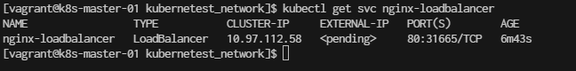
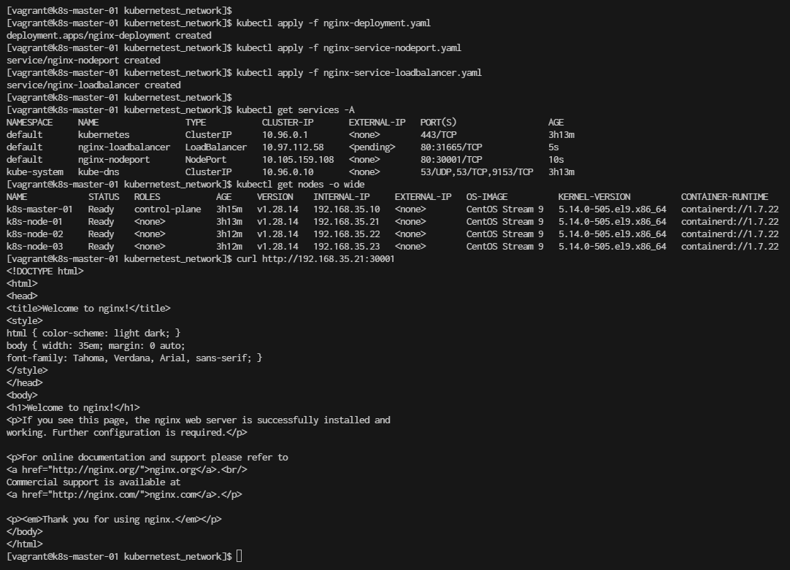
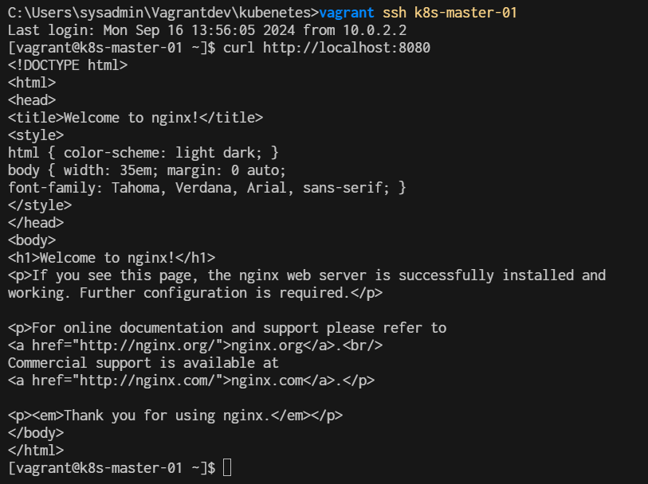

# Config Kubernetes Network Nginx

- **Step 1: Create a Deployment for Nginx**
First, create a Kubernetes deployment to manage the Nginx pods.

```
cd ~
mkdir kubernetest_network
cd kubernetest_network
```

```
cat <<EOF | tee nginx-deployment.yaml
apiVersion: apps/v1
kind: Deployment
metadata:
  name: nginx-deployment
spec:
  replicas: 2
  selector:
    matchLabels:
      app: nginx
  template:
    metadata:
      labels:
        app: nginx
    spec:
      containers:
      - name: nginx
        image: nginx:latest
        ports:
        - containerPort: 80
EOF
```
- Deploy Nginx Pod
```
$ kubectl apply -f nginx-deployment.yaml
```

- **Step 2: Expose the Deployment as a Service**

2.1 Expose Using NodePort
Now, expose the Nginx deployment using a NodePort service, which makes the service accessible on a port of each node in the cluster.

```
cat <<EOF | tee nginx-service-nodeport.yaml
apiVersion: v1
kind: Service
metadata:
  name: nginx-nodeport
spec:
  type: NodePort
  selector:
    app: nginx         # Same selector as in the LoadBalancer service
  ports:
    - protocol: TCP
      port: 80         # Service Port
      targetPort: 80   # Container Port in the nginx pod
      nodePort: 30001  # NodePort for external access,  specify a NodePort in the range 30000-32767
EOF
```

Apply nodeport
```
$ kubectl apply -f nginx-service-nodeport.yaml
```

2.2 get the Node IP of the nodes in your Kubernetes cluster, you can use the following methods:
```
$ kubectl get nodes -o wide
```

2.3 Expose pod and enable external access by using LoadBalance

```
cat <<EOF | tee nginx-service-loadbalancer.yaml
apiVersion: v1
kind: Service
metadata:
  name: nginx-loadbalancer
spec:
  type: LoadBalancer
  selector:
    app: nginx  # This must match the selector used in nginx-nodeport.yaml
  ports:
    - protocol: TCP
      port: 80         # Service Port
      targetPort: 80   # Container Port in the nginx pod
EOF
```


**Explanation:**  
- Both the NodePort and LoadBalancer services target the same pods (those with the label app: nginx).
- The selector (app: nginx) is common in both services and matches the labels defined in the nginx-deployment pods.


**Next we Apply loadbalance**
```
$ kubectl apply -f nginx-service-loadbalancer.yaml
```

**Check the external IP assigned to the LoadBalancer:**
```
$ kubectl get svc nginx-loadbalancer
```


You should see the service with TYPE: LoadBalancer and its CLUSTER-IP (in this case, 10.97.112.58).

Check Service endpoint (pod) is running
```
$ kubectl get pods -l app=nginx
NAME                                READY   STATUS    RESTARTS   AGE
nginx-deployment-7c79c4bf97-jphp8   1/1     Running   0          9m42s
nginx-deployment-7c79c4bf97-mn6hw   1/1     Running   0          9m42s
```

Summary Command:



- **Step3 Verification**
```
For NodePort, use a browser or curl to access Nginx via http://<node-ip>:30001.
For LoadBalancer, once the external IP is available, access Nginx via http://<external-ip>.
```

**Observations:**

- nginx-loadbalancer: This service type is LoadBalancer, but its EXTERNAL-IP is still pending. This typically means the cluster is waiting for a cloud provider or load balancer to assign an external IP.
- nginx-nodeport: This service type is NodePort, which exposes the service on a port across all nodes. It uses port 30001 on each node, which you can use to access the service externally by hitting http://<NodeIP>:30001.

```
However, your EXTERNAL-IP is still in a pending state, which means Kubernetes is waiting for a cloud provider to assign it an external IP. This won’t work if you’re not using a supported cloud provider.
```

**Use kubectl port-forward**
You can forward a port from your local machine to the service running in the cluster. This allows you to access the service locally without needing an external IP.

Run the following command:
```
$ kubectl port-forward svc/nginx-loadbalancer 8080:80
Forwarding from 127.0.0.1:8080 -> 80
```

Open Second teminal and ssh to k8s-master-01
```
$ curl http://localhost:8080
```



- **Clean Up**
Once you're done, delete the resources:

```
$ kubectl delete -f nginx-deployment.yaml
$ kubectl delete -f nginx-service-nodeport.yaml
$ kubectl delete -f nginx-service-loadbalancer.yaml
```