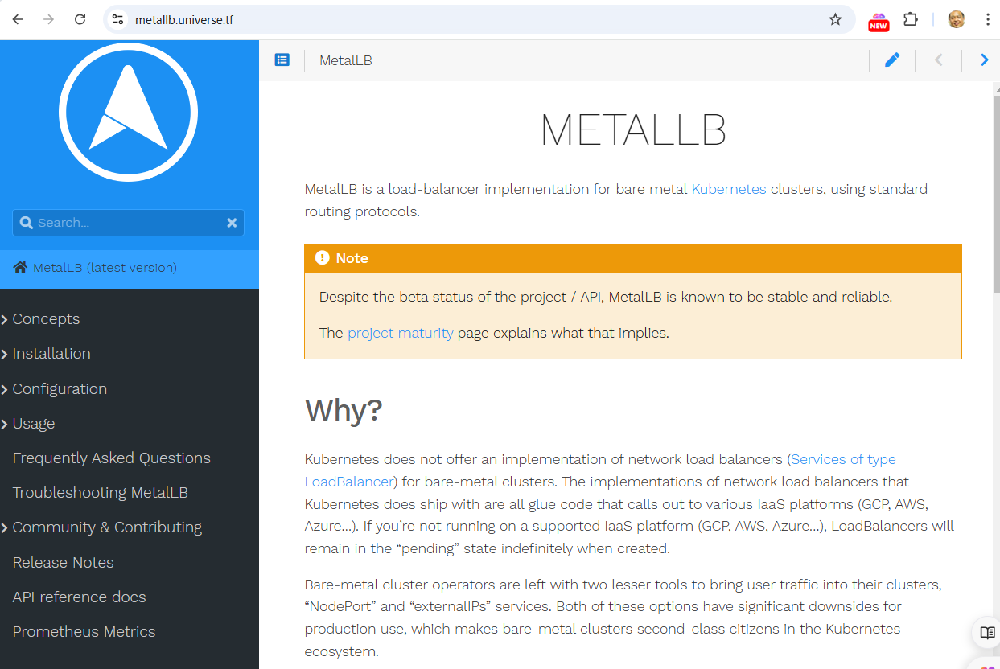
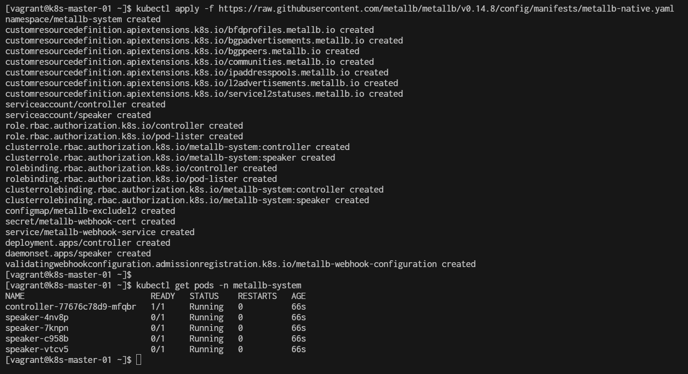
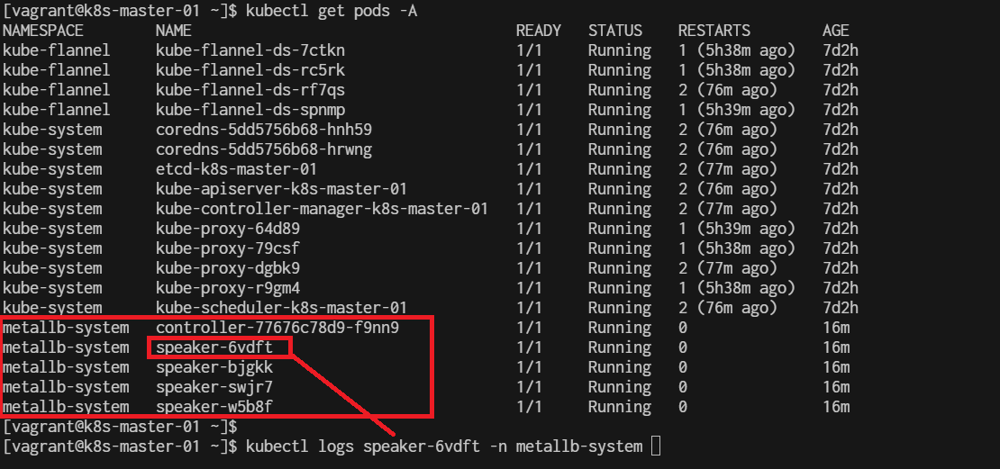
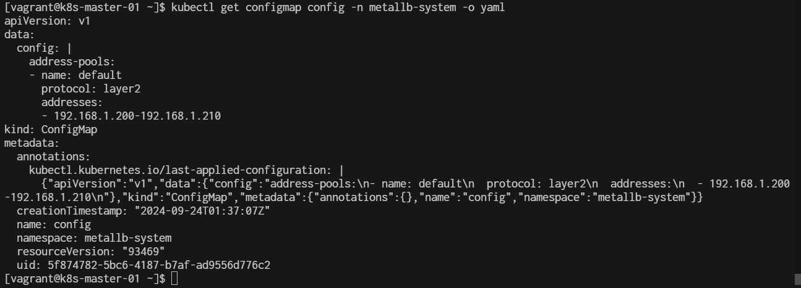
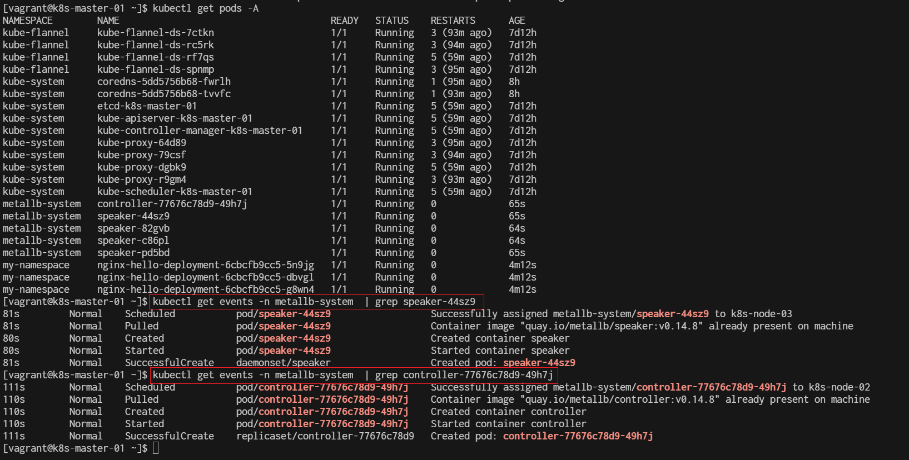
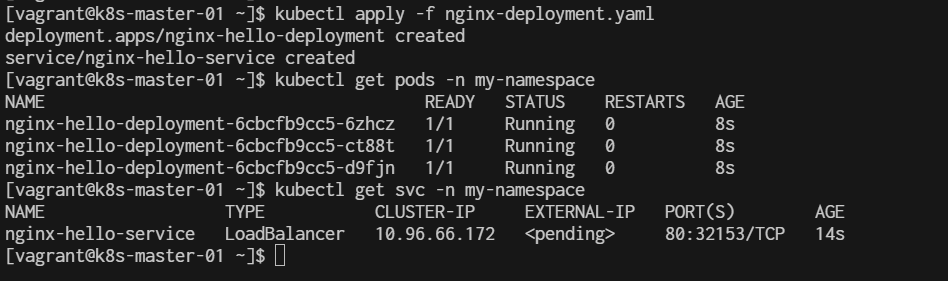
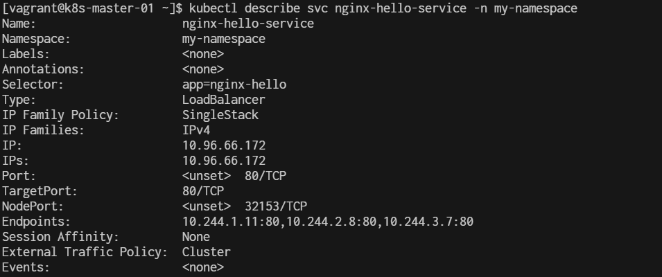

# MetalLB

**Why?**  
Kubernetes does not offer an implementation of network load balancers (Services of type LoadBalancer) for bare-metal clusters. The implementations of network load balancers that Kubernetes does ship with are all glue code that calls out to various IaaS platforms (GCP, AWS, Azure…). If you’re not running on a supported IaaS platform (GCP, AWS, Azure…), LoadBalancers will remain in the “pending” state indefinitely when created.

Bare-metal cluster operators are left with two lesser tools to bring user traffic into their clusters, “NodePort” and “externalIPs” services. Both of these options have significant downsides for production use, which makes bare-metal clusters second-class citizens in the Kubernetes ecosystem.

MetalLB aims to redress this imbalance by offering a network load balancer implementation that integrates with standard network equipment, so that external services on bare-metal clusters also “just work” as much as possible.


we  simulate a LoadBalancer using MetalLB  [https://metallb.universe.tf/](https://metallb.universe.tf/)




Allow firewall: run on everynode
```
$ sudo firewall-cmd --add-port=7946/tcp --permanent
$ sudo firewall-cmd --add-port=7472/tcp --permanent
$ sudo firewall-cmd --add-port=8080/tcp --permanent
$ sudo firewall-cmd --add-icmp-block-inversion
$ sudo firewall-cmd --add-service=dhcp --permanent
$ sudo firewall-cmd --reload
$ sudo firewall-cmd --list-ports
```
- Speaker: Port 7946 (TCP) for communication and service management.
- Controller: Port 8080 (TCP) for managing IP allocation.

**Preparation**
```
kubectl get configmap kube-proxy -n kube-system -o yaml | \
sed -e "s/strictARP: false/strictARP: true/" | \
kubectl apply -f - -n kube-system
```

**Installation Metallb by manifest**  
**To install MetalLB, apply the manifest:**
```
$ kubectl apply -f https://raw.githubusercontent.com/metallb/metallb/v0.14.8/config/manifests/metallb-native.yaml

```
[https://github.com/metallb/metallb/](https://github.com/metallb/metallb/)




In the context of Kubernetes, a manifest is a YAML or JSON file that defines the desired state of a resource in the cluster. It describes the configuration and specifications of various Kubernetes objects, such as Pods, Services, Deployments, ConfigMaps, and more.  
This command will create the necessary components for MetalLB, including the controller and speaker deployments.

**Verify the Installation:**
```
$ kubectl get pods -n metallb-system
NAME                          READY   STATUS    RESTARTS   AGE
controller-77676c78d9-wzwwm   1/1     Running   0          39m
speaker-7q7kw                 1/1     Running   0          39m
speaker-7t6hm                 1/1     Running   0          39m
speaker-gccwq                 1/1     Running   0          39m
speaker-wbwrh                 1/1     Running   0          39m
```
- 4 node will have 4 `speaker-<speake-pod-name>`
```
$ kubectl logs -n metallb-system <controller-pod-name>
$ kubectl logs -n metallb-system <speake-pod-name>
```
example:
```
kubectl logs -n metallb-system controller-77676c78d9-wzwwm
kubectl logs -n metallb-system speaker-7q7kw
```

show pods and log:



get event
```
$ kubectl get events -n metallb-system
```

Describe pod:
```
$ kubectl describe pods -n metallb-system
```

**Configure MatalLB**  
MetalLB needs a configuration to know which IP addresses it can use. You can create a ConfigMap to specify a pool of IP addresses. Here’s an example:

Create a file named metallb-config.yaml with the following content:

```
cat <<EOF |  tee metallb-config.yaml
apiVersion: v1
kind: ConfigMap
metadata:
  namespace: metallb-system
  name: config
data:
  config: |
    address-pools:
    - name: default
      protocol: layer2
      addresses:
      - 192.168.1.200-192.168.1.210
EOF
```

apply configmap
```
$ kubectl apply -f metallb-config.yaml
$ kubectl get pods -A
```

verify config map
```
$ kubectl get configmap config -n metallb-system -o yaml
```

descripe
```
$ kubectl describe configmap config -n metallb-system
```

output to yml:


- if needed to delete please run command delete ```kubectl delete configmaps config -n metallb-system```

show how to log event:


Create Deployment
```
cat <<EOF | tee nginx-deployment.yaml
apiVersion: apps/v1
kind: Deployment
metadata:
  name: nginx-hello-deployment
  namespace: my-namespace  # Replace with your namespace if necessary
spec:
  replicas: 3
  selector:
    matchLabels:
      app: nginx-hello
  template:
    metadata:
      labels:
        app: nginx-hello
    spec:
      containers:
      - name: nginx-hello
        image: nginxdemos/nginx-hello:latest
        ports:
        - containerPort: 80
---
apiVersion: v1
kind: Service
metadata:
  name: nginx-hello-service
  namespace: my-namespace  # Replace with your namespace if necessary
spec:
  selector:
    app: nginx-hello
  ports:
    - protocol: TCP
      port: 80
      targetPort: 80
  type: LoadBalancer
EOF
```

Apply menifest:
```
$ kubectl apply -f nginx-deployment.yaml
$ kubectl get pods -A
$ kubectl get pods -n my-namespace
$ kubectl get svc -n my-namespace
```
External IPs:  
The kubectl describe svc and kubectl get svc commands will display the external IP of a Service.


```
$ kubectl describe svc nginx-hello-service -n my-namespace
```


# Summary kube command
```
kubectl get nodes -o wide
kubectl get all --all-namespaces
kubectl get all                                         # namespace defalut
kubectl get all -n metallb-system                       # namespace metallb-system
kubectl describe configmap config -n metallb-system     # configmap
```

```
kubectl describe configmap -n kube-system kube-proxy
kubectl describe pods -n metallb-system
```
# Delete

```
$ kubectl delete -f https://raw.githubusercontent.com/metallb/metallb/v0.14.8/config/manifests/metallb-native.yaml
$ kubectl delete -f nginx-deployment.yaml  && kubectl delete -f metallb-config.yaml
```

# Delete resource 
```
$ kubectl get deployments -A
$ kubectl delete deployments nginx-hello-deployment -n my-namespace
$ kubectl delete pod -n metallb-system --all
$ kubectl delete  services -n my-namespace --all
```

# Restart Metallb component
```
$ kubectl rollout restart daemonset speaker -n metallb-system
$ kubectl rollout restart deployment controller -n metallb-system
```

# Check Metallb log
```
$ kubectl logs -n metallb-system daemonset/speaker
$ kubectl logs -n metallb-system deployment/controller

```


```
cat <<EOF | tee ipaddresspool.yaml
apiVersion: metallb.io/v1beta1
kind: IPAddressPool
metadata:
  name: ip-pool
  namespace: metallb-system
spec:
  addresses: 
    - 192.168.1.100-192.168.1.120
EOF
```