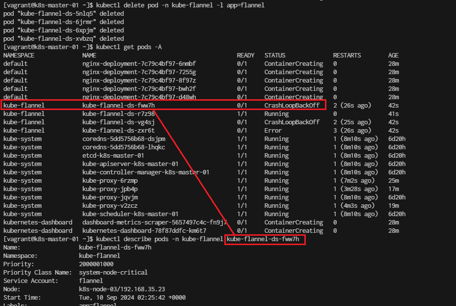
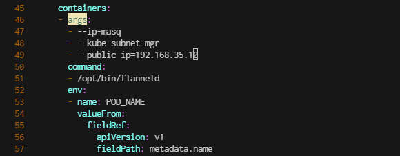
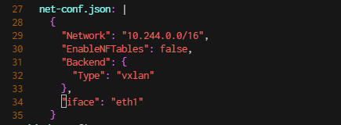
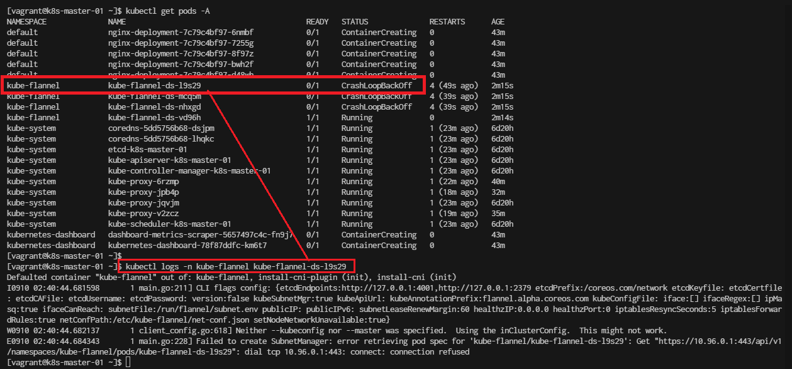

# nginx

- Run on Master node
```
vagrant ssh k8s-master-01
```

create project folder
```
[vagrant@k8s-master-01 ~]$ mkdir nginx
[vagrant@k8s-master-01 ~]$ cd nginx
[vagrant@k8s-master-01 ~]$ 
```

- create file nginx-deployment.yml
```
cat <<EOF | tee nginx-deployment.yml
apiVersion: apps/v1
kind: Deployment
metadata:
  name: nginx-deployment
  labels:
    app: nginx
spec:
  replicas: 3  # Number of replicas/pods
  selector:
    matchLabels:
      app: nginx
  template:
    metadata:
      labels:
        app: nginx
    spec:
      containers:
      - name: nginx
        image: nginx:latest  # Image to use
        ports:
        - containerPort: 80  # Port exposed by the container
EOF
```

- create file nginx-service.yml
```
cat <<EOF | tee nginx-service.yml
apiVersion: v1
kind: Service
metadata:
  name: nginx-service
spec:
  selector:
    app: nginx
  ports:
    - protocol: TCP
      port: 80  # Port exposed by the service
      targetPort: 80  # Port the container listens on
  type: LoadBalancer  # Expose the service externally (for cloud providers)
EOF
```

- Confirm:
```
[vagrant@k8s-master-01 nginx]$ cat nginx-deployment.yml
[vagrant@k8s-master-01 nginx]$ cat nginx-service.yml
```

- Command:
```
[vagrant@k8s-master-01 nginx]$ kubectl apply -f nginx-deployment.yml
deployment.apps/nginx-deployment created

[vagrant@k8s-master-01 nginx]$ kubectl apply -f nginx-service.yml
service/nginx-service created
```
- Result:
```
[vagrant@k8s-master-01 nginx]$ kubectl get deployments
NAME               READY   UP-TO-DATE   AVAILABLE   AGE
nginx-deployment   0/3     3            0           4m58s

[vagrant@k8s-master-01 nginx]$ kubectl get pods
NAME                                READY   STATUS              RESTARTS   AGE
nginx-deployment-7c79c4bf97-2s9hw   0/1     ContainerCreating   0          5m17s
nginx-deployment-7c79c4bf97-k4xzg   0/1     ContainerCreating   0          5m17s
nginx-deployment-7c79c4bf97-r696b   0/1     ContainerCreating   0          5m17s

[vagrant@k8s-master-01 nginx]$ kubectl get services
NAME            TYPE           CLUSTER-IP      EXTERNAL-IP   PORT(S)        AGE
kubernetes      ClusterIP      10.96.0.1       <none>        443/TCP        6d9h
nginx-service   LoadBalancer   10.108.240.12   <pending>     80:31348/TCP   5m18s
```
- Copy result to document

- scan up/down replica
```
[vagrant@k8s-master-01 nginx]$ kubectl scale deployment nginx-deployment --replicas=5
deployment.apps/nginx-deployment scaled
```

- Verify the Change
```
[vagrant@k8s-master-01 nginx]$ kubectl get deployment nginx-deployment
NAME               READY   UP-TO-DATE   AVAILABLE   AGE
nginx-deployment   0/5     5            0           7m26s
```

- check pods scale
```
[vagrant@k8s-master-01 nginx]$ kubectl get pods
NAME                                READY   STATUS              RESTARTS   AGE
nginx-deployment-7c79c4bf97-2s9hw   0/1     ContainerCreating   0          9m16s
nginx-deployment-7c79c4bf97-k4xzg   0/1     ContainerCreating   0          9m16s
nginx-deployment-7c79c4bf97-lxdff   0/1     ContainerCreating   0          2m14s
nginx-deployment-7c79c4bf97-r696b   0/1     ContainerCreating   0          9m16s
nginx-deployment-7c79c4bf97-st7bs   0/1     ContainerCreating   0          2m14s
```

- monitor get pod information 
> ```kubectl describe -n <name space> pod <pod-name>```
```
[vagrant@k8s-master-01 nginx]$ kubectl describe pod nginx-deployment-7c79c4bf97-2s9hw
Name:             nginx-deployment-7c79c4bf97-2s9hw
Namespace:        default
Priority:         0
Service Account:  default
Node:             k8s-node-03/10.0.2.15
Start Time:       Mon, 09 Sep 2024 15:01:25 +0000
Labels:           app=nginx
                  pod-template-hash=7c79c4bf97
Annotations:      <none>
Status:           Pending
IP:
IPs:              <none>
Controlled By:    ReplicaSet/nginx-deployment-7c79c4bf97
Containers:
  nginx:
    Container ID:   
    Image:          nginx:latest
    Image ID:       
    Port:           80/TCP
    Host Port:      0/TCP
    State:          Waiting
      Reason:       ContainerCreating
    Ready:          False
    Restart Count:  0
    Environment:    <none>
    Mounts:
      /var/run/secrets/kubernetes.io/serviceaccount from kube-api-access-pvhtj (ro)
Conditions:
  Type              Status
  Initialized       True 
  Ready             False 
  ContainersReady   False 
  PodScheduled      True 
Volumes:
  kube-api-access-pvhtj:
    Type:                    Projected (a volume that contains injected data from multiple sources)
    TokenExpirationSeconds:  3607
    ConfigMapName:           kube-root-ca.crt
    ConfigMapOptional:       <nil>
    DownwardAPI:             true
QoS Class:                   BestEffort
Node-Selectors:              <none>
Tolerations:                 node.kubernetes.io/not-ready:NoExecute op=Exists for 300s
                             node.kubernetes.io/unreachable:NoExecute op=Exists for 300s
Events:
  Type     Reason                  Age                   From               Message
  ----     ------                  ----                  ----               -------
  Normal   Scheduled               24m                   default-scheduler  Successfully assigned default/nginx-deployment-7c79c4bf97-2s9hw to k8s-node-03
  Warning  FailedCreatePodSandBox  24m                   kubelet            Failed to create pod sandbox: rpc error: code = Unknown desc = failed to setup network for sandbox "ae490c910f6a0dec2e812fc3b3198e6a34af14f84112b4caecd59d2c11074560": plugin type="flannel" failed (add): loadFlannelSubnetEnv failed: open /run/flannel/subnet.env: no such file or directory
  Warning  FailedCreatePodSandBox  24m                   kubelet            Failed to create pod sandbox: rpc error: code = Unknown desc = failed to setup network for sandbox "eff5d2eb49107eb092d57273506fe33e7552ed4dba2bb6dccb47088a79fb6a66": plugin type="flannel" failed (add): loadFlannelSubnetEnv failed: open /run/flannel/subnet.env: no such file or directory
  Warning  FailedCreatePodSandBox  24m                   kubelet            Failed to create pod sandbox: rpc error: code = Unknown desc = failed to setup network for sandbox "fc687c70c1f938b814859764f419a548dc68da24ed5aa3ca98b5f7367fa83c1e": plugin type="flannel" failed (add): loadFlannelSubnetEnv failed: open /run/flannel/subnet.env: no such file or directory
  Warning  FailedCreatePodSandBox  23m                   kubelet            Failed to create pod sandbox: rpc error: code = Unknown desc = failed to setup network for sandbox "33268f64682665e403b6617f5bb12ed947c13810214ee5f4c9cc7da78a30874c": plugin type="flannel" failed (add): loadFlannelSubnetEnv failed: open /run/flannel/subnet.env: no such file or directory
  Warning  FailedCreatePodSandBox  23m                   kubelet            Failed to create pod sandbox: rpc error: code = Unknown desc = failed to setup network for sandbox "756eb61e9c3a61e444b17761ea114159cbc6566c2d263bf6770efe63af2a1cfc": plugin type="flannel" failed (add): loadFlannelSubnetEnv failed: open /run/flannel/subnet.env: no such file or directory
  Warning  FailedCreatePodSandBox  23m                   kubelet            Failed to create pod sandbox: rpc error: code = Unknown desc = failed to setup network for sandbox "1796e298156bf87070808686d464518a43a1b86a4928fe7fd488f80ddd175705": plugin type="flannel" failed (add): loadFlannelSubnetEnv failed: open /run/flannel/subnet.env: no such file or directory
  Warning  FailedCreatePodSandBox  23m                   kubelet            Failed to create pod sandbox: rpc error: code = Unknown desc = failed to setup network for sandbox "4071acc27d6d6095ff08e1f1ba7423791b8473896f336aec4fd8316b33acd271": plugin type="flannel" failed (add): loadFlannelSubnetEnv failed: open /run/flannel/subnet.env: no such file or directory
  Warning  FailedCreatePodSandBox  22m                   kubelet            Failed to create pod sandbox: rpc error: code = Unknown desc = failed to setup network for sandbox "9baf93fa41bf4f8a16fb4170877812ecf1e273059603d6e87344c68c8240958d": plugin type="flannel" failed (add): loadFlannelSubnetEnv failed: open /run/flannel/subnet.env: no such file or directory
  Warning  FailedCreatePodSandBox  22m                   kubelet            Failed to create pod sandbox: rpc error: code = Unknown desc = failed to setup network for sandbox "c116fc6b864ebc1b3f3aa2afc01bf02ab05b92060ce9b72bde0131bbc42d5f77": plugin type="flannel" failed (add): loadFlannelSubnetEnv failed: open /run/flannel/subnet.env: no such file or directory
  Warning  FailedCreatePodSandBox  4m26s (x84 over 22m)  kubelet            (combined from similar events): Failed to create pod sandbox: rpc error: code = Unknown desc = failed to setup network for sandbox "b72e7878ea9f699210ee4543eea89421fb1b6c86cb003cd316da8536c34dd1ac": plugin type="flannel" failed (add): loadFlannelSubnetEnv failed: open /run/flannel/subnet.env: no such file or directory
[vagrant@k8s-master-01 nginx]$
```

- Error
```
  Warning  FailedCreatePodSandBox  4m26s (x84 over 22m)  kubelet            (combined from similar events): Failed to create pod sandbox: rpc error: code = Unknown desc = failed to setup network for sandbox "b72e7878ea9f699210ee4543eea89421fb1b6c86cb003cd316da8536c34dd1ac": plugin type="flannel" failed (add): loadFlannelSubnetEnv failed: open /run/flannel/subnet.env: no such file or directory
```

- Error
```
[vagrant@k8s-master-01 nginx]$ kubectl get pods --all-namespaces
NAMESPACE              NAME                                         READY   STATUS              RESTARTS         AGE
default                nginx-deployment-7c79c4bf97-2s9hw            0/1     ContainerCreating   0                27m   
default                nginx-deployment-7c79c4bf97-k4xzg            0/1     ContainerCreating   0                27m   
default                nginx-deployment-7c79c4bf97-lxdff            0/1     ContainerCreating   0                20m   
default                nginx-deployment-7c79c4bf97-r696b            0/1     ContainerCreating   0                27m   
default                nginx-deployment-7c79c4bf97-st7bs            0/1     ContainerCreating   0                20m   
kube-flannel           kube-flannel-ds-4gnzc                        1/1     Running             1 (107m ago)     6d9h  
kube-flannel           kube-flannel-ds-bdk6f                        0/1     CrashLoopBackOff    67 (98s ago)     6d9h  
kube-flannel           kube-flannel-ds-gdh99                        0/1     CrashLoopBackOff    68 (2m45s ago)   6d9h  
kube-flannel           kube-flannel-ds-l8fv7                        0/1     CrashLoopBackOff    64 (3m59s ago)   6d9h  
kube-system            coredns-5dd5756b68-dsjpm                     1/1     Running             1 (107m ago)     6d9h  
kube-system            coredns-5dd5756b68-lhqkc                     1/1     Running             1 (107m ago)     6d9h  
kube-system            etcd-k8s-master-01                           1/1     Running             1 (107m ago)     6d9h  
kube-system            kube-apiserver-k8s-master-01                 1/1     Running             1 (107m ago)     6d9h  
kube-system            kube-controller-manager-k8s-master-01        1/1     Running             1 (107m ago)     6d9h  
kube-system            kube-proxy-64mvb                             1/1     Running             2 (96m ago)      6d9h  
kube-system            kube-proxy-82slw                             1/1     Running             1 (104m ago)     6d9h  
kube-system            kube-proxy-jqvjm                             1/1     Running             1 (107m ago)     6d9h  
kube-system            kube-proxy-rg4v2                             1/1     Running             2 (100m ago)     6d9h  
kube-system            kube-scheduler-k8s-master-01                 1/1     Running             1 (107m ago)     6d9h  
kubernetes-dashboard   dashboard-metrics-scraper-5657497c4c-rtpxl   0/1     ContainerCreating   0                5d9h  
kubernetes-dashboard   kubernetes-dashboard-78f87ddfc-c2tc2         0/1     ContainerCreating   0                99m   
[vagrant@k8s-master-01 nginx]$

```
> Error CrashLoopBackOff
> ```kubectl describe -n <name space> pod <pod-name>```
- Chcker flanel port 
```
[vagrant@k8s-master-01 nginx]$ kubectl describe pod -n kube-flannel  kube-flannel-ds-gdh99
```

- Delete flannel
```
[vagrant@k8s-master-01 nginx]$ sudo kubectl --kubeconfig /etc/kubernetes/admin.conf delete -f https://github.com/flannel-io/flannel/releases/latest/download/kube-flannel.yml
namespace "kube-flannel" deleted
serviceaccount "flannel" deleted
clusterrole.rbac.authorization.k8s.io "flannel" deleted
clusterrolebinding.rbac.authorization.k8s.io "flannel" deleted
configmap "kube-flannel-cfg" deleted
daemonset.apps "kube-flannel-ds" deleted

```

- Confirm delete 
> kubectl get pods --all-namespaces
> kubectl get pods --all-namespaces -o wide
> kubectl get pods -A
```
[vagrant@k8s-master-01 nginx]$ kubectl get pods --all-namespaces
NAMESPACE              NAME                                         READY   STATUS              RESTARTS       AGE
default                nginx-deployment-7c79c4bf97-2s9hw            0/1     ContainerCreating   0              37m     
default                nginx-deployment-7c79c4bf97-k4xzg            0/1     ContainerCreating   0              37m     
default                nginx-deployment-7c79c4bf97-lxdff            0/1     ContainerCreating   0              30m     
default                nginx-deployment-7c79c4bf97-r696b            0/1     ContainerCreating   0              37m     
default                nginx-deployment-7c79c4bf97-st7bs            0/1     ContainerCreating   0              30m     
kube-system            coredns-5dd5756b68-dsjpm                     1/1     Running             1 (118m ago)   6d9h    
kube-system            coredns-5dd5756b68-lhqkc                     1/1     Running             1 (118m ago)   6d9h    
kube-system            etcd-k8s-master-01                           1/1     Running             1 (118m ago)   6d9h    
kube-system            kube-apiserver-k8s-master-01                 1/1     Running             1 (118m ago)   6d9h    
kube-system            kube-controller-manager-k8s-master-01        1/1     Running             1 (118m ago)   6d9h    
kube-system            kube-proxy-64mvb                             1/1     Running             2 (107m ago)   6d9h    
kube-system            kube-proxy-82slw                             1/1     Running             1 (114m ago)   6d9h    
kube-system            kube-proxy-jqvjm                             1/1     Running             1 (118m ago)   6d9h    
kube-system            kube-proxy-rg4v2                             1/1     Running             2 (110m ago)   6d9h    
kube-system            kube-scheduler-k8s-master-01                 1/1     Running             1 (118m ago)   6d9h    
kubernetes-dashboard   dashboard-metrics-scraper-5657497c4c-rtpxl   0/1     ContainerCreating   0              5d10h   
kubernetes-dashboard   kubernetes-dashboard-78f87ddfc-c2tc2         0/1     ContainerCreating   0              109m 
```

- Reapply Flannel For pod network
```
[vagrant@k8s-master-01 nginx]$ kubectl apply -f https://github.com/flannel-io/flannel/releases/latest/download/kube-flannel.yml
namespace/kube-flannel created
clusterrole.rbac.authorization.k8s.io/flannel created
clusterrolebinding.rbac.authorization.k8s.io/flannel created
serviceaccount/flannel created
configmap/kube-flannel-cfg created
daemonset.apps/kube-flannel-ds created
```

- get pod
```
[vagrant@k8s-master-01 ~]$ kubectl get pods -A
NAMESPACE              NAME                                         READY   STATUS              RESTARTS        AGE
default                nginx-deployment-7c79c4bf97-2s9hw            0/1     ContainerCreating   0               89m
default                nginx-deployment-7c79c4bf97-k4xzg            0/1     ContainerCreating   0               89m
default                nginx-deployment-7c79c4bf97-lxdff            0/1     ContainerCreating   0               82m
default                nginx-deployment-7c79c4bf97-r696b            0/1     ContainerCreating   0               89m
default                nginx-deployment-7c79c4bf97-st7bs            0/1     ContainerCreating   0               82m
kube-flannel           kube-flannel-ds-rvbmj                        1/1     Running             0               13m
kube-flannel           kube-flannel-ds-tqq4x                        0/1     CrashLoopBackOff    7 (2m53s ago)   13m
kube-flannel           kube-flannel-ds-v6kjd                        0/1     CrashLoopBackOff    7 (3m1s ago)    13m
kube-flannel           kube-flannel-ds-z545q                        0/1     CrashLoopBackOff    7 (2m59s ago)   13m
kube-system            coredns-5dd5756b68-dsjpm                     1/1     Running             2 (37m ago)     6d10h
kube-system            coredns-5dd5756b68-lhqkc                     1/1     Running             2 (37m ago)     6d10h
kube-system            etcd-k8s-master-01                           1/1     Running             2 (37m ago)     6d10h
kube-system            kube-apiserver-k8s-master-01                 1/1     Running             2 (37m ago)     6d10h
kube-system            kube-controller-manager-k8s-master-01        1/1     Running             2 (37m ago)     6d10h
kube-system            kube-proxy-64mvb                             1/1     Running             2 (159m ago)    6d10h
kube-system            kube-proxy-82slw                             1/1     Running             1 (166m ago)    6d10h
kube-system            kube-proxy-jqvjm                             1/1     Running             2 (37m ago)     6d10h
kube-system            kube-proxy-rg4v2                             1/1     Running             2 (162m ago)    6d10h
kube-system            kube-scheduler-k8s-master-01                 1/1     Running             2 (37m ago)     6d10h
kubernetes-dashboard   dashboard-metrics-scraper-5657497c4c-rtpxl   0/1     ContainerCreating   0               5d10h
kubernetes-dashboard   kubernetes-dashboard-78f87ddfc-c2tc2         0/1     ContainerCreating   0               161m
```

- Descript pod **kube-flannel-ds-tqq4x**
```
[vagrant@k8s-master-01 ~]$ kubectl describe pods -n kube-flannel kube-flannel-ds-tqq4x 
...
Events:
  Type     Reason     Age                   From               Message
  ----     ------     ----                  ----               -------
  Normal   Scheduled  14m                   default-scheduler  Successfully assigned kube-flannel/kube-flannel-ds-tqq4x to k8s-node-02
  Normal   Pulled     14m                   kubelet            Container image "docker.io/flannel/flannel-cni-plugin:v1.5.1-flannel2" already present on machine
  Normal   Created    14m                   kubelet            Created container install-cni-plugin
  Normal   Started    14m                   kubelet            Started container install-cni-plugin
  Normal   Pulled     14m                   kubelet            Container image "docker.io/flannel/flannel:v0.25.6" already present on machine
  Normal   Created    14m                   kubelet            Created container install-cni
  Normal   Started    14m                   kubelet            Started container install-cni
  Normal   Pulled     13m (x4 over 14m)     kubelet            Container image "docker.io/flannel/flannel:v0.25.6" already present on machine
  Normal   Created    13m (x4 over 14m)     kubelet            Created container kube-flannel
  Normal   Started    13m (x4 over 14m)     kubelet            Started container kube-flannel
  Warning  BackOff    4m29s (x48 over 14m)  kubelet            Back-off restarting failed container kube-flannel in pod kube-flannel-ds-tqq4x_kube-flannel(fd2bd215-2a85-425c-bfa2-51b8637cfde5)

```
**Note Error**
> Error1 :
> Back-off restarting failed container kube-flannel in pod kube-flannel-ds-tqq4x_kube-flannel


> Error2:
> E0910 02:15:40.235391   38408 memcache.go:265] couldn't get current server API group list: Get "http://localhost:8080/api?timeout=32s": dial tcp 127.0.0.1:8080: connect: connection refused
```
cd .kube
rm -r cache
```

**Delete all flannel flannel will restart**
```
[vagrant@k8s-master-01 ~]$ kubectl delete pod -n kube-flannel -l app=flannel
pod "kube-flannel-ds-5nlq5" deleted
pod "kube-flannel-ds-6jrmr" deleted
pod "kube-flannel-ds-6xpjm" deleted
pod "kube-flannel-ds-xvbzq" deleted
```




- monitor Status
```
[vagrant@k8s-master-01 ~]$ kubectl get configmap kubeadm-config -n kube-system -o yaml
apiVersion: v1
data:
  ClusterConfiguration: |
    apiServer:
      extraArgs:
        authorization-mode: Node,RBAC
      timeoutForControlPlane: 4m0s
    apiVersion: kubeadm.k8s.io/v1beta3
    certificatesDir: /etc/kubernetes/pki
    clusterName: kubernetes
    controlPlaneEndpoint: 192.168.35.10:6443
    controllerManager: {}
    dns: {}
    etcd:
      local:
        dataDir: /var/lib/etcd
    imageRepository: registry.k8s.io
    kind: ClusterConfiguration
    kubernetesVersion: v1.28.13
    networking:
      dnsDomain: cluster.local
      podSubnet: 10.244.0.0/16
      serviceSubnet: 10.96.0.0/12
    scheduler: {}
kind: ConfigMap
metadata:
  creationTimestamp: "2024-09-03T06:01:07Z"
  name: kubeadm-config
  namespace: kube-system
  resourceVersion: "234"
  uid: 8dcc223c-2d9b-4c4c-9218-eba644a02eb7
```

```
[vagrant@k8s-master-01 ~]$ kubectl describe nodes k8s-master-01
...
...
Annotations:        flannel.alpha.coreos.com/backend-data: {"VNI":1,"VtepMAC":"ba:bf:d5:f2:ee:87"}
                    flannel.alpha.coreos.com/backend-type: vxlan
                    flannel.alpha.coreos.com/kube-subnet-manager: true
                    flannel.alpha.coreos.com/public-ip: 10.0.2.15

...
```
because flannel.alpha.coreos.com/public-ip: 10.0.2.15  is map to eth0. which is wrong have to fix it

## Steps to Ensure Persistent Changes to the Public IP:
- stet 1 Forcefully Set the Public IP with Node Annotations: Ensure you are properly overwriting the annotation and it is not being reverted by some other process.
```
[vagrant@k8s-master-01 ~]$ kubectl annotate nodes k8s-master-01 flannel.alpha.coreos.com/public-ip=192.168.35.10 --overwrite
node/k8s-master-01 annotated
```

- step 2 Confirm the Annotation Update: After running the above command, check if the annotation persists by describing the node:
```
[vagrant@k8s-master-01 ~]$ kubectl describe nodes k8s-master-01
Name:               k8s-master-01
Roles:              control-plane
Labels:             beta.kubernetes.io/arch=amd64
                    beta.kubernetes.io/os=linux
                    kubernetes.io/arch=amd64
                    kubernetes.io/hostname=k8s-master-01
                    kubernetes.io/os=linux
                    node-role.kubernetes.io/control-plane=
                    node.kubernetes.io/exclude-from-external-load-balancers=
Annotations:        flannel.alpha.coreos.com/backend-data: {"VNI":1,"VtepMAC":"ba:bf:d5:f2:ee:87"}
                    flannel.alpha.coreos.com/backend-type: vxlan
                    flannel.alpha.coreos.com/kube-subnet-manager: true
                    flannel.alpha.coreos.com/public-ip: 192.168.35.10
                    kubeadm.alpha.kubernetes.io/cri-socket: unix:///var/run/containerd/containerd.sock
                    node.alpha.kubernetes.io/ttl: 0
                    volumes.kubernetes.io/controller-managed-attach-detach: true
CreationTimestamp:  Tue, 03 Sep 2024 06:01:04 +0000
Taints:             node-role.kubernetes.io/control-plane:NoSchedule
```

- step 3 annotation and overide
```
[vagrant@k8s-master-01 ~]$ kubectl annotate nodes k8s-node-01 flannel.alpha.coreos.com/public-ip=192.168.35.10 --overwr
ite
node/k8s-node-01 annotated
[vagrant@k8s-master-01 ~]$ kubectl annotate nodes k8s-node-02 flannel.alpha.coreos.com/public-ip=192.168.35.10 --overwr
ite
node/k8s-node-02 annotated
[vagrant@k8s-master-01 ~]$ kubectl annotate nodes k8s-node-03 flannel.alpha.coreos.com/public-ip=192.168.35.10 --overwr
ite
node/k8s-node-03 annotated
```
> 

- 4 Edit Flannel DeamonSet to use correct ip
```
[vagrant@k8s-master-01 ~]$ kubectl edit ds kube-flannel-ds -n kube-flannel
```

```
      containers:
      - args:
        - --ip-masq
        - --kube-subnet-mgr
        - --public-ip=192.168.35.10
```




- 4 Update the Flannel ConfigMap: Ensure the iface configuration in the net-conf.json section of the Flannel ConfigMap specifies eth1:
```
[vagrant@k8s-master-01 ~]$ kubectl edit configmap kube-flannel-cfg -n kube-flannel

```

```
  net-conf.json: |
    {
      "Network": "10.244.0.0/16",
      "EnableNFTables": false,
      "Backend": {
        "Type": "vxlan"
      },
      "iface": "eth1"
    }
```


- Restart the flannel DeamonSet
```
[vagrant@k8s-master-01 ~]$ kubectl delete pod -n kube-flannel -l app=flannel
pod "kube-flannel-ds-227h8" deleted
pod "kube-flannel-ds-hlfh4" deleted
pod "kube-flannel-ds-lmmjt" deleted
pod "kube-flannel-ds-x26m6" deleted
```

```
[vagrant@k8s-master-01 ~]$ kubectl get pods -A
```




## Workshop Delete node from cluster

```
[vagrant@k8s-master-01 ~]$ kubectl delete nodes k8s-node-01
node "k8s-node-01" deleted
[vagrant@k8s-master-01 ~]$ kubectl delete nodes k8s-node-02
node "k8s-node-02" deleted
[vagrant@k8s-master-01 ~]$ kubectl delete nodes k8s-node-03
node "k8s-node-03" deleted
```

- Get join string from master
```
 kubeadm token create --print-join-command
```

- Run step below to rejoin worker node
```
[vagrant@k8s-node-01 ~]$ sudo systemctl stop kubelet.service
[vagrant@k8s-node-01 ~]$ sudo rm -rf /etc/kubernetes/kubelet.conf
[vagrant@k8s-node-01 ~]$ sudo rm -rf /etc/kubernetes/pki/ca.crt 
[vagrant@k8s-node-01 ~]$ sudo kubeadm join 192.168.35.10:6443 --token r05guo.rbmhatyu9trjibb9 --discovery-token-ca-cert-hash sha256:d0ab73def1046c2472f835e1d1c870095845964e2a22816a1dd3d38214208cbe
```


>
## Change inter ip from eth0 to eth1 of each node

- we can Check node internal ip for each node
```
[vagrant@k8s-master-01 ~]$ kubectl get nodes -o wide
NAME            STATUS   ROLES           AGE     VERSION    INTERNAL-IP   EXTERNAL-IP   OS-IMAGE          KERNEL-VERSION          CONTAINER-RUNTIME
k8s-master-01   Ready    control-plane   6d11h   v1.28.13   10.0.2.15     <none>        CentOS Stream 9   5.14.0-503.el9.x86_64   containerd://1.7.21
k8s-node-01     Ready    <none>          13m     v1.28.13   10.0.2.15     <none>        CentOS Stream 9   5.14.0-503.el9.x86_64   containerd://1.7.21
k8s-node-02     Ready    <none>          11m     v1.28.13   10.0.2.15     <none>        CentOS Stream 9   5.14.0-503.el9.x86_64   containerd://1.7.21
k8s-node-03     Ready    <none>          11m     v1.28.13   10.0.2.15     <none>        CentOS Stream 9   5.14.0-503.el9.x86_64   containerd://1.7.21
```
- we will change ```INTERNAL-IP``` to ip of eth1. Edit file ``` /etc/sysconfig/kubelet```
```
[vagrant@k8s-master-01 ~]$  sudo vim /etc/sysconfig/kubelet
```

Content:
```
KUBELET_EXTRA_ARGS='--node-ip 192.168.35.10'
```

- and reload kubelet
```
[vagrant@k8s-master-01 ~]$ sudo systemctl daemon-reload
[vagrant@k8s-master-01 ~]$ sudo systemctl restart kubelet.service
```
- Verify Internal IP ```kubectl get nodes -o wide```
```
[vagrant@k8s-master-01 ~]$ kubectl get nodes -o wide
NAME            STATUS   ROLES           AGE     VERSION    INTERNAL-IP     EXTERNAL-IP   OS-IMAGE          KERNEL-VERSION          CONTAINER-RUNTIME
k8s-master-01   Ready    control-plane   6d11h   v1.28.13   192.168.35.10   <none>        CentOS Stream 9   5.14.0-503.el9.x86_64   containerd://1.7.21
k8s-node-01     Ready    <none>          20m     v1.28.13   10.0.2.15       <none>        CentOS Stream 9   5.14.0-503.el9.x86_64   containerd://1.7.21
k8s-node-02     Ready    <none>          18m     v1.28.13   10.0.2.15       <none>        CentOS Stream 9   5.14.0-503.el9.x86_64   containerd://1.7.21
k8s-node-03     Ready    <none>          17m     v1.28.13   10.0.2.15       <none>        CentOS Stream 9   5.14.0-503.el9.x86_64   containerd://1.7.21
```

### Rejoin node Go to ```k8s-node-01```

- Edit config
```
[vagrant@k8s-node-01 ~]$ sudo vim /etc/sysconfig/kubelet
KUBELET_EXTRA_ARGS='--node-ip 192.168.35.21'
```

```
[vagrant@k8s-node-02 ~]$ sudo vim /etc/sysconfig/kubelet
KUBELET_EXTRA_ARGS='--node-ip 192.168.35.22'
```

```
[vagrant@k8s-node-03 ~]$ sudo vim /etc/sysconfig/kubelet
KUBELET_EXTRA_ARGS='--node-ip 192.168.35.23'
```

Check result
```
[vagrant@k8s-master-01 ~]$ kubectl get nodes -o wide
NAME            STATUS   ROLES           AGE   VERSION    INTERNAL-IP     EXTERNAL-IP   OS-IMAGE          KERNEL-VERSION          CONTAINER-RUNTIME
k8s-master-01   Ready    control-plane   42m   v1.28.13   192.168.35.10   <none>        CentOS Stream 9   5.14.0-391.el9.x86_64   containerd://1.7.21
k8s-node-01     Ready    <none>          33m   v1.28.13   192.168.35.21   <none>        CentOS Stream 9   5.14.0-391.el9.x86_64   containerd://1.7.21
k8s-node-02     Ready    <none>          33m   v1.28.13   192.168.35.22   <none>        CentOS Stream 9   5.14.0-391.el9.x86_64   containerd://1.7.21
k8s-node-03     Ready    <none>          32m   v1.28.13   192.168.35.23   <none>        CentOS Stream 9   5.14.0-391.el9.x86_64   containerd://1.7.21
```
>

