# Nodeport network
# Create Loadbalancer

We use ```nginxdemos/nginx-hello``` to test loadbalance
[https://github.com/nginxinc/NGINX-Demos/tree/master/nginx-hello-nonroot](https://github.com/nginxinc/NGINX-Demos/tree/master/nginx-hello-nonroot)
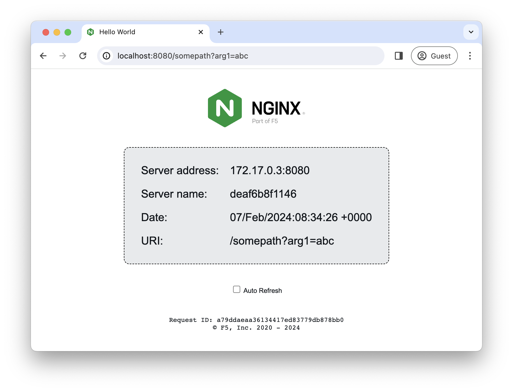

How to run with docker:
(run in kube master)
```
$ docker run -P -d nginxdemos/nginx-hello
```
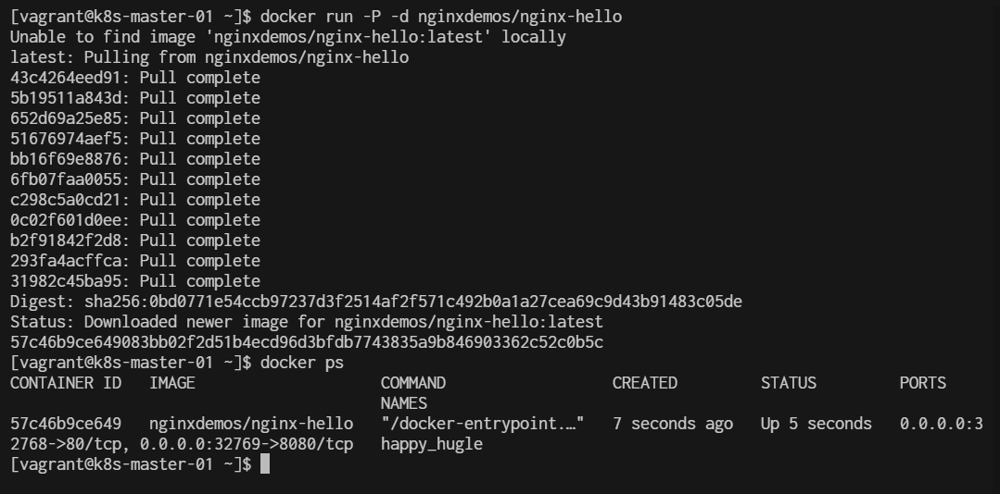

Run follow command:
```
$ ip address show docker0
$ docker ps
$ docker network ls
$ docker inspect happy_hugle | jq '.[0].NetworkSettings'
```
- Dockers create bridge network for containers to connect 

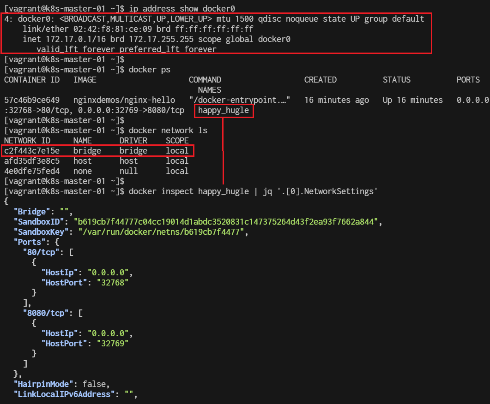

go bellow part of output. it will show ip of Container with connect to bride

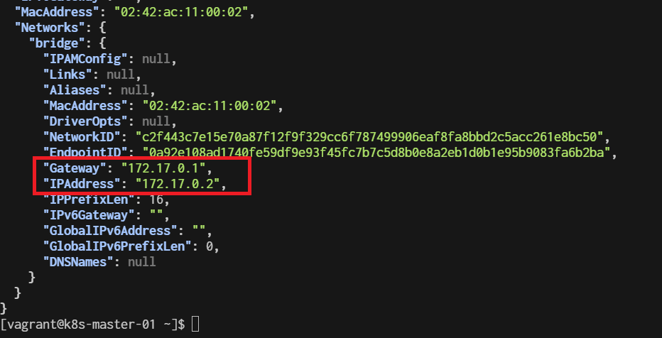

Test Container nginx by open ```curl ip:port```

```
curl http://172.17.0.2:8080
```
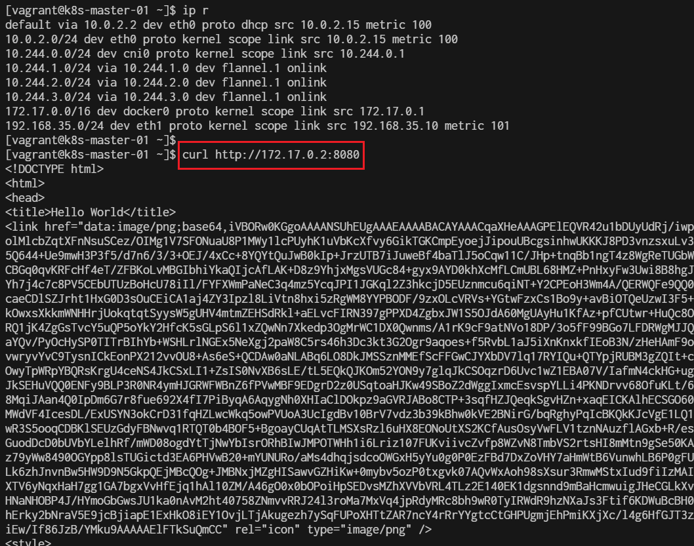

## Run container in Kubernetes Cluster
```
$ kubectl create namespace my-namespace
$ kubectl run nginx --image nginxdemos/nginx-hello  -n my-namespace
```
- Create namespace name my-namespace
It will create a Kubernetes Pod named nginx with the image nginxdemos/nginx-hello in namespace. However, this command in its default form may not expose the application to external traffic.

```
$ kubectl get pods -n my-namespace
```

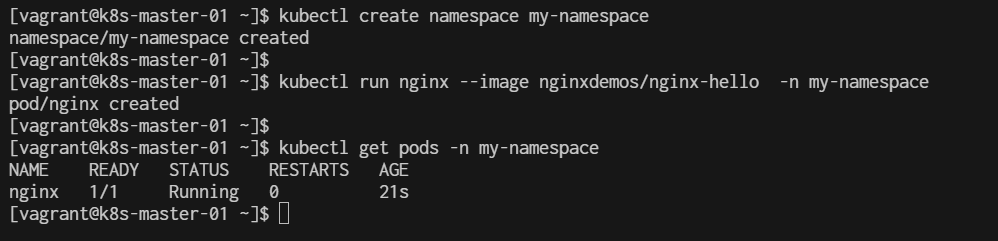

## Exposing the pod

If you want to expose this nginx pod on a specific port so that it can be accessed externally, you can do so using a Service.

You can expose the Pod using the following command:
```
$ kubectl expose pod nginx --type=NodePort --port=8080 -n my-namespace
```

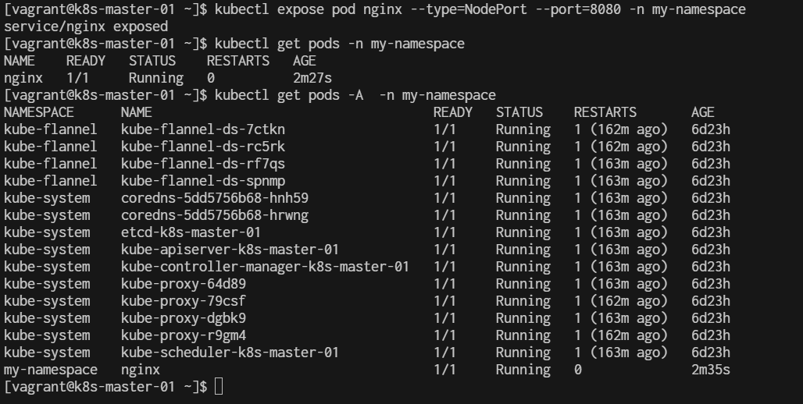

Here’s a breakdown of what each part of this command does:

- **kubectl expose pod nginx**: Exposes the pod named nginx by creating a service.
- **--type=NodePort**: Specifies the service type as NodePort, which will expose the service on a port accessible from outside the cluster.
- **--port=8080**: Maps the pod's port to the service's port (8080 in this case).
- **-n my-namespace**: Targets the my-namespace namespace where the nginx pod resides.

Verify the service:
```
$ kubectl get services -n my-namespace
```

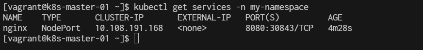

- The output should show the nginx service with a NodePort assigned (:30843), which will be accessible from outside the cluster using the node's IP address and the specified port.
- port of pod is 8080

To locat which node that pod install into:
```
$ kubectl get pods -n my-namespace -o wide
```

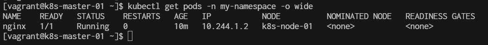

To Descript pod
```
$ kubectl describe pod nginx -n my-namespace
```

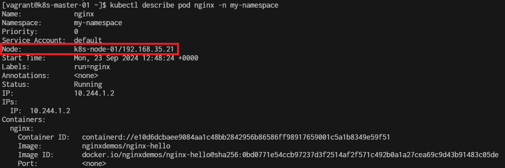

To Get ip of node:
```
$ kubectl get node -A -o wide
```
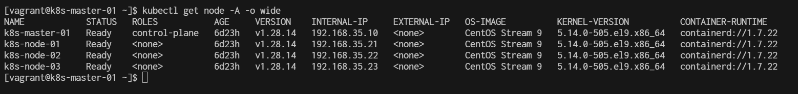


To Open Browser [http://192.168.35.21:30843/](http://192.168.35.21:30843/)

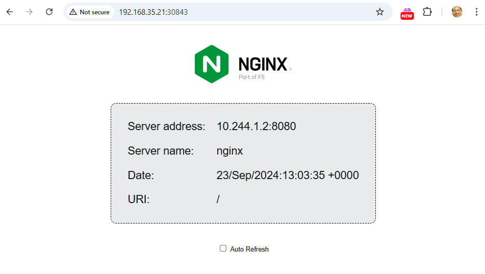
