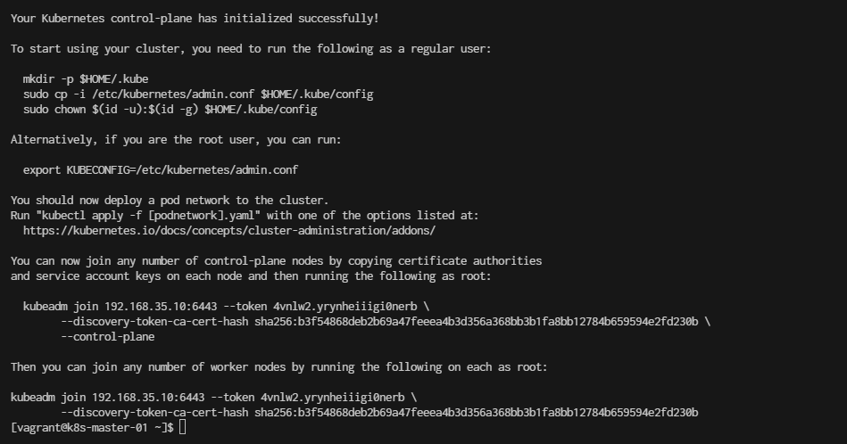

# Reset Cluster

#### Run command ```$ sudo kubeadm reset --force``` in every note
**Prerequistion**
- because last installation have conflic between  flannel and cni

```
[vagrant@k8s-master-01 ]$ kubeadm reset --force
```

```
[vagrant@k8s-master-01 ]$ ip a
1: lo: <LOOPBACK,UP,LOWER_UP> mtu 65536 qdisc noqueue state UNKNOWN group default qlen 1000
    link/loopback 00:00:00:00:00:00 brd 00:00:00:00:00:00
    inet 127.0.0.1/8 scope host lo
       valid_lft forever preferred_lft forever
2: eth0: <BROADCAST,MULTICAST,UP,LOWER_UP> mtu 1500 qdisc fq_codel state UP group default qlen 1000
    link/ether 08:00:27:b3:a2:9c brd ff:ff:ff:ff:ff:ff
    altname enp0s3
    inet 10.0.2.15/24 brd 10.0.2.255 scope global dynamic noprefixroute eth0
       valid_lft 80933sec preferred_lft 80933sec
3: eth1: <BROADCAST,MULTICAST,UP,LOWER_UP> mtu 1500 qdisc fq_codel state UP group default qlen 1000
    link/ether 08:00:27:09:7a:78 brd ff:ff:ff:ff:ff:ff
    altname enp0s8
    inet 192.168.35.10/24 brd 192.168.35.255 scope global noprefixroute eth1
       valid_lft forever preferred_lft forever
4: docker0: <NO-CARRIER,BROADCAST,MULTICAST,UP> mtu 1500 qdisc noqueue state DOWN group default 
    link/ether 02:42:89:05:8d:27 brd ff:ff:ff:ff:ff:ff
    inet 172.17.0.1/16 brd 172.17.255.255 scope global docker0
       valid_lft forever preferred_lft forever
5: flannel.1: <BROADCAST,MULTICAST,UP,LOWER_UP> mtu 1450 qdisc noqueue state UNKNOWN group default 
    link/ether ba:bf:d5:f2:ee:87 brd ff:ff:ff:ff:ff:ff
    inet 10.244.0.0/32 scope global flannel.1
       valid_lft forever preferred_lft forever
6: cni0: <NO-CARRIER,BROADCAST,MULTICAST,UP> mtu 1500 qdisc noqueue state DOWN group default qlen 1000
    link/ether 72:54:39:49:7f:0c brd ff:ff:ff:ff:ff:ff
    inet 10.244.0.1/24 brd 10.244.0.255 scope global cni0
       valid_lft forever preferred_lft forever
```

- Stop network  Down Interface cni0 and flannel.1.
```
[vagrant@k8s-master-01 ]$ sudo ifconfig cni0 down
[vagrant@k8s-master-01 ]$ sudo ifconfig flannel.1 down
```

- Delete Interface cni0 and flannel.1.
```
[vagrant@k8s-master-01 ]$ sudo ip link delete cni0
[vagrant@k8s-master-01 ]$ sudo ip link delete flannel.1
```

```
[vagrant@k8s-master-01 ~]$ ip a
1: lo: <LOOPBACK,UP,LOWER_UP> mtu 65536 qdisc noqueue state UNKNOWN group default qlen 1000
    link/loopback 00:00:00:00:00:00 brd 00:00:00:00:00:00
    inet 127.0.0.1/8 scope host lo
       valid_lft forever preferred_lft forever
2: eth0: <BROADCAST,MULTICAST,UP,LOWER_UP> mtu 1500 qdisc fq_codel state UP group default qlen 1000
    link/ether 08:00:27:b3:a2:9c brd ff:ff:ff:ff:ff:ff
    altname enp0s3
    inet 10.0.2.15/24 brd 10.0.2.255 scope global dynamic noprefixroute eth0
       valid_lft 80547sec preferred_lft 80547sec
3: eth1: <BROADCAST,MULTICAST,UP,LOWER_UP> mtu 1500 qdisc fq_codel state UP group default qlen 1000
    link/ether 08:00:27:09:7a:78 brd ff:ff:ff:ff:ff:ff
    altname enp0s8
    inet 192.168.35.10/24 brd 192.168.35.255 scope global noprefixroute eth1
       valid_lft forever preferred_lft forever
4: docker0: <NO-CARRIER,BROADCAST,MULTICAST,UP> mtu 1500 qdisc noqueue state DOWN group default 
    link/ether 02:42:89:05:8d:27 brd ff:ff:ff:ff:ff:ff
    inet 172.17.0.1/16 brd 172.17.255.255 scope global docker0
       valid_lft forever preferred_lft forever
```

- Remove all items within /etc/cni/net.d/.
```
[vagrant@k8s-master-01 ]$ sudo rm -rf /etc/cni/net.d/
```

```
$ sudo kubeadm init \
  --control-plane-endpoint=192.168.35.10 \
  --pod-network-cidr=10.244.0.0/16 \
  --apiserver-advertise-address=192.168.35.10
```


```
  rm -rf /home/vagrant/.kube
  mkdir -p /home/vagrant/.kube
  sudo cp -i /etc/kubernetes/admin.conf /home/vagrant/.kube/config
  sudo chown -R vagrant:vagrant /home/vagrant/.kube/config
```

install flannel
```
kubectl  apply -f https://github.com/flannel-io/flannel/releases/latest/download/kube-flannel.yml
namespace/kube-flannel created
serviceaccount/flannel created
clusterrole.rbac.authorization.k8s.io/flannel created
clusterrolebinding.rbac.authorization.k8s.io/flannel created
configmap/kube-flannel-cfg created
daemonset.apps/kube-flannel-ds created
```

re-run
```

```
```
[vagrant@k8s-master-01 ~]$  kubeadm token create --print-join-command

kubeadm join 192.168.35.10:6443 --token x7cucg.42w7cx46w24bk800 --discovery-token-ca-cert-hash sha256:b3f54868deb2b69a47feeea4b3d356a368bb3b1fa8bb12784b659594e2fd230b 
```

Go to k8s-node-01
```
[vagrant@k8s-node-01 ~]$ sudo kubeadm join 192.168.35.10:6443 --token x7cucg.42w7cx46w24bk800 --discovery-token-ca-cert-hash sha256:b3f54868deb2b69a47feeea4b3d356a368bb3b1fa8bb12784b659594e2fd230b

[preflight] Running pre-flight checks
[preflight] Reading configuration from the cluster...
[preflight] FYI: You can look at this config file with 'kubectl -n kube-system get cm kubeadm-config -o yaml'
[kubelet-start] Writing kubelet configuration to file "/var/lib/kubelet/config.yaml"
[kubelet-start] Writing kubelet environment file with flags to file "/var/lib/kubelet/kubeadm-flags.env"
[kubelet-start] Starting the kubelet
[kubelet-start] Waiting for the kubelet to perform the TLS Bootstrap...

This node has joined the cluster:
* Certificate signing request was sent to apiserver and a response was received.
* The Kubelet was informed of the new secure connection details.

Run 'kubectl get nodes' on the control-plane to see this node join the cluster.
```

Go to k8s-node-02
```
[vagrant@k8s-node-02 ~]$ sudo kubeadm join 192.168.35.10:6443 --token x7cucg.42w7cx46w24bk800 --discovery-token-ca-cert-hash sha256:b3f54868deb2b69a47feeea4b3d356a368bb3b1fa8bb12784b659594e2fd230b
[preflight] Running pre-flight checks
[preflight] Reading configuration from the cluster...
[preflight] FYI: You can look at this config file with 'kubectl -n kube-system get cm kubeadm-config -o yaml'
[kubelet-start] Writing kubelet configuration to file "/var/lib/kubelet/config.yaml"
[kubelet-start] Writing kubelet environment file with flags to file "/var/lib/kubelet/kubeadm-flags.env"
[kubelet-start] Starting the kubelet
[kubelet-start] Waiting for the kubelet to perform the TLS Bootstrap...

This node has joined the cluster:
* Certificate signing request was sent to apiserver and a response was received.
* The Kubelet was informed of the new secure connection details.

Run 'kubectl get nodes' on the control-plane to see this node join the cluster.
```

```
[vagrant@k8s-master-01 ~]$ kubectl get nodes -o wide
NAME            STATUS     ROLES           AGE     VERSION    INTERNAL-IP     EXTERNAL-IP   OS-IMAGE          KERNEL-VERSION          CONTAINER-RUNTIME
k8s-master-01   NotReady   control-plane   20m     v1.28.13   192.168.35.10   <none>        CentOS Stream 9   5.14.0-503.el9.x86_64   containerd://1.7.21
k8s-node-01     Ready      <none>          2m37s   v1.28.13   192.168.35.21   <none>        CentOS Stream 9   5.14.0-503.el9.x86_64   containerd://1.7.21
k8s-node-02     Ready      <none>          54s     v1.28.13   192.168.35.22   <none>        CentOS Stream 9   5.14.0-503.el9.x86_64   containerd://1.7.21
k8s-node-03     Ready      <none>          14s     v1.28.13   192.168.35.23   <none>        CentOS Stream 9   5.14.0-503.el9.x86_64   containerd://1.7.21
```
