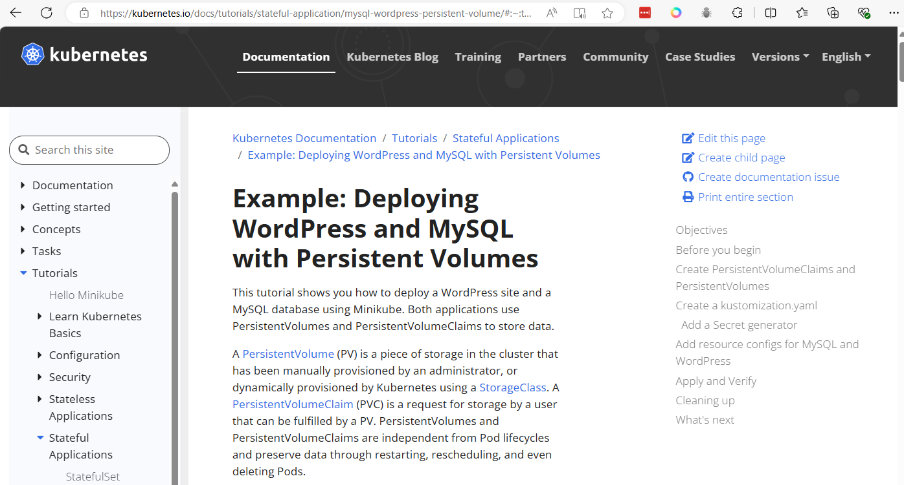

# Wordpress deployment

[Original ref](https://kubernetes.io/docs/tutorials/stateful-application/mysql-wordpress-persistent-volume/#:~:text=Example%3A%20Deploying%20WordPress%20and%20MySQL%20with%20Persistent%20Volumes,a%20WordPress%20site%20and%20a%20MySQL%20database.%20)
```
cd 
mkdir wordpress
cd wordpress
```

```
cat <<EOF | tee kustomization.yaml
secretGenerator:
- name: mysql-pass
  literals:
  - password=YOUR_PASSWORD
EOF
```

```
cat <<EOF | tee mysql-deployment.yaml
apiVersion: v1
kind: Service
metadata:
  name: wordpress-mysql
  labels:
    app: wordpress
spec:
  ports:
    - port: 3306
  selector:
    app: wordpress
    tier: mysql
  clusterIP: None
---
apiVersion: v1
kind: PersistentVolumeClaim
metadata:
  name: mysql-pv-claim
  labels:
    app: wordpress
spec:
  accessModes:
    - ReadWriteOnce
  resources:
    requests:
      storage: 20Gi
---
apiVersion: apps/v1
kind: Deployment
metadata:
  name: wordpress-mysql
  labels:
    app: wordpress
spec:
  selector:
    matchLabels:
      app: wordpress
      tier: mysql
  strategy:
    type: Recreate
  template:
    metadata:
      labels:
        app: wordpress
        tier: mysql
    spec:
      containers:
      - image: mysql:8.0
        name: mysql
        env:
        - name: MYSQL_ROOT_PASSWORD
          valueFrom:
            secretKeyRef:
              name: mysql-pass
              key: password
        - name: MYSQL_DATABASE
          value: wordpress
        - name: MYSQL_USER
          value: wordpress
        - name: MYSQL_PASSWORD
          valueFrom:
            secretKeyRef:
              name: mysql-pass
              key: password
        ports:
        - containerPort: 3306
          name: mysql
        volumeMounts:
        - name: mysql-persistent-storage
          mountPath: /var/lib/mysql
      volumes:
      - name: mysql-persistent-storage
        persistentVolumeClaim:
          claimName: mysql-pv-claim

EOF
```

```
cat <<EOF | tee wordpress-deployment.yaml
apiVersion: v1
kind: Service
metadata:
  name: wordpress
  labels:
    app: wordpress
spec:
  ports:
    - port: 80
  selector:
    app: wordpress
    tier: frontend
  type: LoadBalancer
---
apiVersion: v1
kind: PersistentVolumeClaim
metadata:
  name: wp-pv-claim
  labels:
    app: wordpress
spec:
  accessModes:
    - ReadWriteOnce
  resources:
    requests:
      storage: 20Gi
---
apiVersion: apps/v1
kind: Deployment
metadata:
  name: wordpress
  labels:
    app: wordpress
spec:
  selector:
    matchLabels:
      app: wordpress
      tier: frontend
  strategy:
    type: Recreate
  template:
    metadata:
      labels:
        app: wordpress
        tier: frontend
    spec:
      containers:
      - image: wordpress:6.2.1-apache
        name: wordpress
        env:
        - name: WORDPRESS_DB_HOST
          value: wordpress-mysql
        - name: WORDPRESS_DB_PASSWORD
          valueFrom:
            secretKeyRef:
              name: mysql-pass
              key: password
        - name: WORDPRESS_DB_USER
          value: wordpress
        ports:
        - containerPort: 80
          name: wordpress
        volumeMounts:
        - name: wordpress-persistent-storage
          mountPath: /var/www/html
      volumes:
      - name: wordpress-persistent-storage
        persistentVolumeClaim:
          claimName: wp-pv-claim
EOF
```

- Add resource to ```kustomization.yaml```
```
cat <<EOF >> kustomization.yaml
resources:
  - mysql-deployment.yaml
  - wordpress-deployment.yaml
EOF
```

- Folder Structure
```
[vagrant@k8s-master-01 wordpress]$ tree .
.
├── kustomization.yaml
├── mysql-deployment.yaml
└── wordpress-deployment.yaml
```

- Apply and Verify ```kubectl apply -k ./```
```
[vagrant@k8s-master-01 wordpress]$ kubectl apply -k ./
secret/mysql-pass-5m26tmdb5k created
service/wordpress created
service/wordpress-mysql created
persistentvolumeclaim/mysql-pv-claim created
persistentvolumeclaim/wp-pv-claim created
deployment.apps/wordpress created
deployment.apps/wordpress-mysql created
```

- get deployment ```kubectl get deployments```
```
[vagrant@k8s-master-01 wordpress]$ kubectl get deployments
NAME               READY   UP-TO-DATE   AVAILABLE   AGE
...
wordpress          0/1     1            0           7m49s
wordpress-mysql    0/1     1            0           7m49s
```

## Verify  
- Verify that the Secret exists by running the following command:  ```kubectl get secrets```
```
[vagrant@k8s-master-01 wordpress]$ kubectl get secrets
NAME                    TYPE     DATA   AGE
mysql-pass-5m26tmdb5k   Opaque   1      20s
```

- Verify that a PersistentVolume got dynamically provisioned. ```kubectl get pvc```
```
[vagrant@k8s-master-01 wordpress]$ kubectl get pvc
NAME             STATUS    VOLUME   CAPACITY   ACCESS MODES   STORAGECLASS   AGE
mysql-pv-claim   Pending                                                     105s
wp-pv-claim      Pending                                                     105s
```

- Verify that the Pod is running by running the following command: ```kubectl get pods```
```
[vagrant@k8s-master-01 wordpress]$  kubectl get pods

NAME                                READY   STATUS              RESTARTS   AGE
...
wordpress-777799f8bb-ndh97          0/1     Pending             0          2m24s
wordpress-mysql-7d6467b97-pzhn9     0/1     Pending             0          2m24s
```

- Verify Service wordpress ```kubectl get services wordpress```
```
[vagrant@k8s-master-01 wordpress]$ kubectl get services wordpress
NAME        TYPE           CLUSTER-IP      EXTERNAL-IP   PORT(S)        AGE
wordpress   LoadBalancer   10.100.42.138   <pending>     80:31350/TCP   3m10s
```

- Verify All service ```kubectl describe service```
```
[vagrant@k8s-master-01 wordpress]$  kubectl describe service
```

