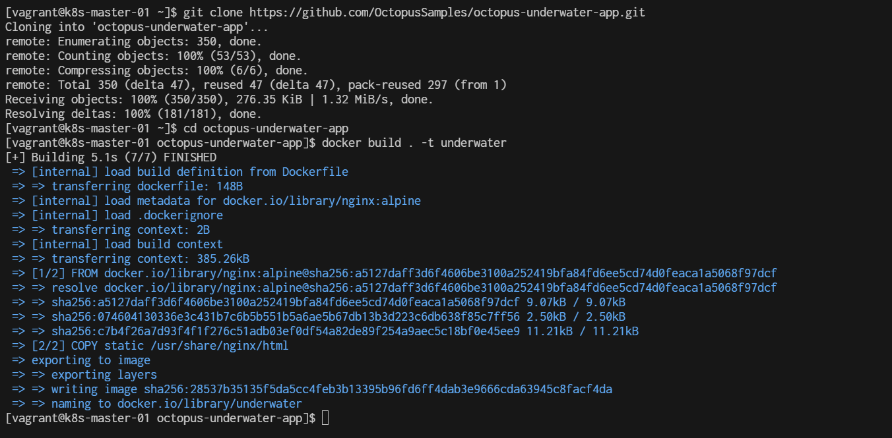
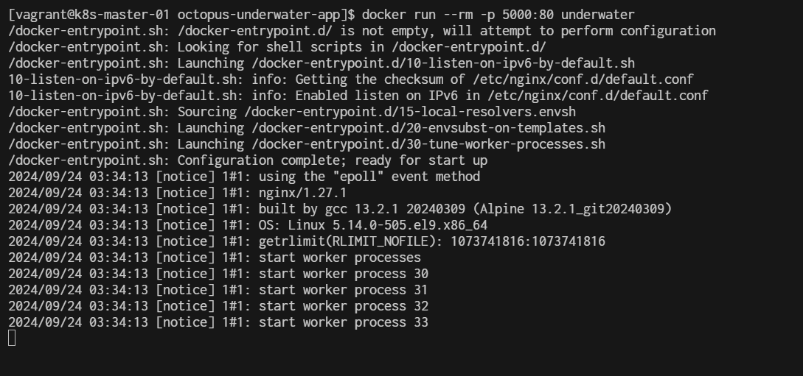
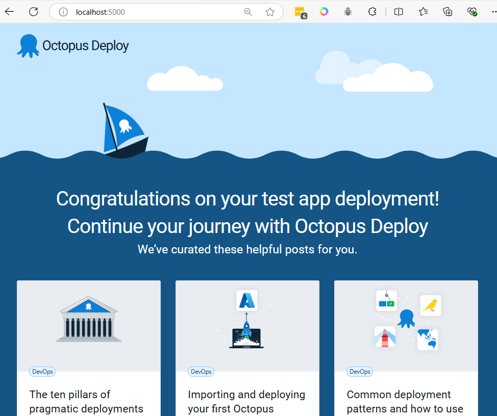
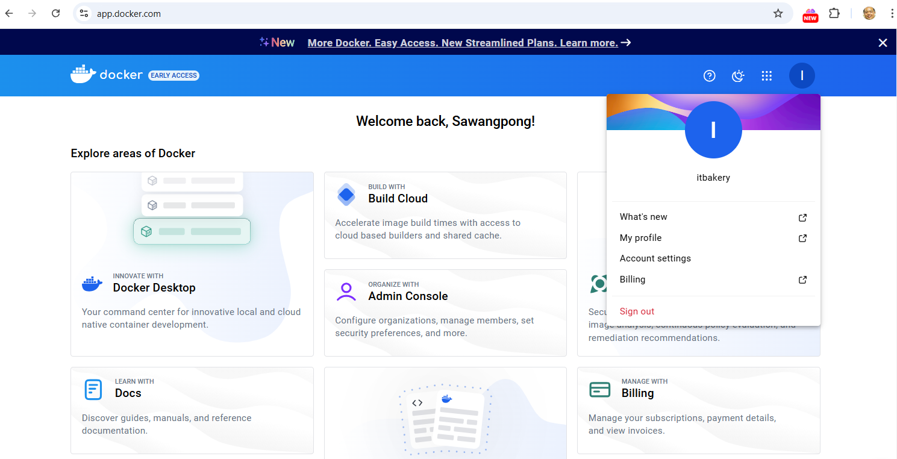

# Workshop1 kubernetes

##prepare##
```
sudo dnf install docker-ce -y 
```
**Step1 Start minikube start**
```
$ kubectl version
Client Version: v1.28.14
Kustomize Version: v5.0.4-0.20230601165947-6ce0bf390ce3
Server Version: v1.28.14
```

**Step2 Cluster pods**  
see all the pods running in the minikube cluster using the command
```
$ kubectl get pods -A
```

**Step3 Cluster Version**
```
$ kubectl version --client -o json
{
  "clientVersion": {
    "major": "1",
    "minor": "28",
    "gitVersion": "v1.28.14",
    "gitCommit": "66f3325d5562da565def802b8bacf431b082991d",
    "gitTreeState": "clean",
    "buildDate": "2024-09-11T08:27:29Z",
    "goVersion": "go1.22.6",
    "compiler": "gc",
    "platform": "linux/amd64"
  },
  "kustomizeVersion": "v5.0.4-0.20230601165947-6ce0bf390ce3"
}
```

**Step4 list manage**
```
$ kubectl get pods --all-namespaces -o jsonpath="{.items[*].spec['initContainers', 'containers'][*].image}" |\
tr -s '[[:space:]]' '\n' |\
sort |\
uniq -c
      4 docker.io/flannel/flannel-cni-plugin:v1.5.1-flannel2
      8 docker.io/flannel/flannel:v0.25.6
      3 nginxdemos/nginx-hello:latest
      1 quay.io/metallb/controller:v0.14.8
      4 quay.io/metallb/speaker:v0.14.8
      2 registry.k8s.io/coredns/coredns:v1.10.1
      1 registry.k8s.io/etcd:3.5.15-0
      1 registry.k8s.io/kube-apiserver:v1.28.14
      1 registry.k8s.io/kube-controller-manager:v1.28.14
      4 registry.k8s.io/kube-proxy:v1.28.14
      1 registry.k8s.io/kube-scheduler:v1.28.14
```


**Step5 Build Docker image**
```
$ sudo dnf install git -y
$ git clone https://github.com/OctopusSamples/octopus-underwater-app.git
$ cd octopus-underwater-app
$ docker build . -t underwater
```



```
$ docker images
REPOSITORY                    TAG       IMAGE ID       CREATED          SIZE
REPOSITORY               TAG       IMAGE ID       CREATED              SIZE
underwater               latest    28537b35135f   About a minute ago   43.6MB
```


**Step6 Finally, run the Docker image with the command:**

```
$ docker run -rm -p 5000:80 underwater
```



**Step7 Test by open other windows terminal**
create ssh forwardport
```
>ssh -L 5000:localhost:5000 vagrant@192.168.35.10
vagrant@192.168.40.10's password: 
Last login: Thu Sep 19 03:31:32 2024 from 192.168.40.10
```


The command you've provided is used to set up SSH port forwarding. Here’s what it does:

- **ssh:** This is the SSH command to log in to a remote machine.
- **-L 5000:localhost:5000:** This sets up local port forwarding. It forwards port 5000 on your local machine to port 5000 on the remote machine (in this case, localhost refers to the remote machine).
- **vagrant@192.168.40.10:** This specifies the user (vagrant) and the remote host's IP address (192.168.40.10) that you're connecting to.
Once this command is executed, you can access services running on port 5000 of the remote machine through port 5000 of your local machine. For example, if the remote machine is running a web application on port 5000, you can access it locally by opening http://localhost:5000 in your browser.

**Step8 Test from browser after ssh reverse**



Ctrl+C to stop running container. then container will be remove with option ```--rm```


**Step9 Push image to registry**
- crate account on docker.io


docker cli login:
```
$ docker login -u username
```
example:


- tag image 
```
$ docker tag underwater <registry-address>/underwater:latest
$ docker images
```
example:
```
$ docker tag underwater itbakery/underwater:latest
```


- Docker push to registry
```
$ docker push underwater <registry-address>/underwater:latest
```
example:
```
$ docker push itbakery/underwater:latest
```


Step19 create deployment yaml
```
cd ~
mkdir deployment
cd deployment
```

```
cat <<EOF | tee underwater.yaml
apiVersion: apps/v1
kind: Deployment
metadata:
  name: underwater-deployment
spec:
  replicas: 1
  selector:
    matchLabels:
      app: underwater
  template:
    metadata:
      labels:
        app: underwater
    spec:
      containers:
      - name: underwater
        image: <registry-address>/underwater:latest
        ports:
        - containerPort: 80  # Adjust this port according to your application

---
apiVersion: v1
kind: Service
metadata:
  name: underwater-service
spec:
  selector:
    app: underwater
  ports:
    - protocol: TCP
      port: 80          # Port exposed by the service
      targetPort: 80    # Port on which the container is listening
  type: NodePort  # Change this to LoadBalancer or ClusterIP if needed

EOF
```
- change registry-address to yours

**Then deploy the app with the command:**
```
$ kubectl apply -f underwater.yaml 
deployment.apps/underwater-deployment created
service/underwater-service created
```


open browser http://192.168.35.21:32052/

